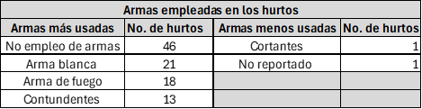

```{r setup, include=FALSE}
library(tidyverse)
library(janitor)
library(flextable)
library(knitr)
library(kableExtra)
library(dplyr)
knitr::opts_chunk$set(echo = TRUE)  
```
```{css,echo=FALSE}
.column {display:flex;}
h1{color:rgb(26, 72, 112)}
h2{color:rgb(26, 72, 112)}
h3{color:rgb(26, 72, 112)}
```
<br>
<div style="text-align: justify">
En este apartado se busca realizar los procedimientos pertinentes para una buena descripción estadística del conjunto de datos, es decir, una vez identificado las dimensiones y tipos de variables a tratar, se pretende organizar y resumir la información mediante el empelo medidas de tendencia central y dispersión, así como, el desarrollo y creación de tablas de frecuencia y graficas pertinentes que muestren de manera clara y concisa la información sobre hurtos y delincuencia en las distintas regiones del territorio nacional, para así poder realizar conclusiones útiles sobre la basa de datos. 
<div/>
<br>

# Análisis exploratorio inicial

<div style="text-align: justify">
Con el propósito de brindar más información al ministerio sobre el conjunto de características medidas en el conjunto de datos *hurtos2*, se procederá a realizar un análisis exploratorio preliminar que permita conocer sobre el centro de distribución de los datos, su dispersión y asimetría. Para esto, procederemos a calcular medidas de tendencia central para identificar la asimetría existente, al igual que calcularemos medidas con el rango, la varianza, la desviación estándar y el coeficiente de varianza con el fin de identificar el grado de dispersión y variabilidad entre los datos. Dado que este tipo de análisis solo se puede realizar para variables de carácter cuantitativo, procederemos a tomar en cuenta las variables “EDAD” y “ESTATURA_AGRESOR”.
<div/>
<br>

## Análisis Estadístico Descriptivo para la variable **EDAD**

### **Media**

<div style="text-align: justify">
Teniendo en cuenta que la media, en el caso de la variable edad, Se calcula sumando todos las edades las víctimas del conjunto de datos y dividiendo esta suma por el número total de valores, se tiene que la media de edades es: 
<div/>
```{r}
suma_edades <- sum(hurtos2$EDAD, na.rm = TRUE) # suma de las edades considerando sus frecuencias absolutas
numero_edades <- sum(!is.na(hurtos2$EDAD)) #Cantidad total de datos
media_edad <- suma_edades / numero_edades #Fórmula teórica para el cálculo de la media
print(media_edad)
```
<div style="text-align: justify">
Que la edad media de las víctimas sea de 35.87 años, teniendo en cuenta que se tienen 100 datos, simboliza que, en promedio, las víctimas tienen aproximadamente 35.87 años.Este valor de la media proporciona una idea del “centro” de las edades de las víctimas en del conjunto de datos. Sin embargo, es importante tener en cuenta que la media puede verse influenciada por valores extremos (muy altos o muy bajos). Por ejemplo, si hay algunas víctimas significativamente más jóvenes o mayores que la mayoría, esto puede afectar la media.
<div/>
<br>

### **Mediana**

<div style="text-align: justify">
Teniendo en cuenta que la mediana es la edad que se encuentra justo en el medio del conjunto de datos una vez ordenados, se tiene que la mediana de las edades es: 
<div/>
```{r}
edades_ordenadas <- sort(hurtos2$EDAD, na.last = NA) # se organizan las edades de menor a mayor
n <- length(edades_ordenadas)
#se crea la variable mediana y se formula un condicional dependiendo si la cantidad total de datos es par o impar
mediana_edad <- if (n %% 2 == 1) {
  edades_ordenadas[(n + 1) / 2]
} else {
  (edades_ordenadas[n / 2] + edades_ordenadas[(n / 2) + 1]) / 2
}
print(mediana_edad)
```
<br>
<div style="text-align: justify">
Una mediana de 35 años significa que, en el conjunto de datos, la edad que se encuentra en el punto medio es de 35. Esto implica que la mitad de las personas en la muestra tienen edades menores o iguales a 35 años, y la otra mitad tiene edades mayores o iguales a 35 años. Por tanto, una mediana de 35 años indica que 35 años es una edad representativa del centro de tu distribución de edades.
<div/>
<br>

### **Moda**

<div style="text-align: justify">
Considerando que la moda es la edad que posee una mayor frecuencia absoluta se tiene que la moda de las edades es: 
<div/>
```{r}
# Definimos una función para calcular la moda
moda <- function(x) {
  frecuencias <- table(x)
  moda <- as.numeric(names(frecuencias[frecuencias == max(frecuencias)]))
  return(moda)
}
moda_edad <- moda(hurtos2$EDAD)# Calculamos la moda de la columna 'EDAD'
print(moda_edad)
```
<div style="text-align: justify">
Si la moda de las edades de las víctimas es 31, esto significa que la edad de 31 años es la más común entre las víctimas del  conjunto de datos. En otras palabras, hay más víctimas de 31 años que de cualquier otra edad en la muestra.
<div/>
<br>
<div style="text-align: justify">
Dado una moda de 31, una media de 35.87 y una mediana de 35, podemos analizar la asimetría de la distribución de los datos de la siguinte forma:

Media (35.87) **>** Mediana (35) **>** Moda (31): Esto indica una asimetría positiva o sesgo a la derecha. En otras palabras, la cola de la distribución se extiende más hacia la derecha.La asimetría positiva sugiere que hay valores extremos altos que están influyendo en la media, haciendo que sea mayor que la mediana y la moda. En términos prácticos, una asimetría positiva puede indicar que hay algunos individuos con edades significativamente mayores que la mayoría del grupo, lo que está afectando la media.
<div/>
<br>
<div style="text-align: justify">
Ahora se procederá a calcular, el rango, la varianza, la desviación estándar y el coeficiente de varianza, con el objetivo de observar la dispersión y variabilidad entre las edades de la victima con la media. De igual forma, el cálculo de la desviación estándar, en conjunto con la media y la mediana nos permitirá identificar el coeficiente de asimetría de esta variable más adelante, para así completar un poco más este análisis. 
<div/>
<br>

### **Rango**

<div style="text-align: justify">
El rango se comprende como la diferencia entre la edad mayor y la menor, por tanto, el rango es: 
<div/>
```{r}
rango_edad <- max(hurtos2$EDAD, na.rm = TRUE) - min(hurtos2$EDAD, na.rm = TRUE)
print(rango_edad)
```
<div style="text-align: justify">
Un rango de 65 significa que la diferencia entre la edad más joven y la edad más vieja en tu conjunto de datos es de 65 años. Este rango indica una gran variabilidad en las edades de las víctimas. Esto sugiere que hay una amplia dispersión de edades, desde muy jóvenes hasta muy mayores.  
<div/>
<br>

### **Varianza**

<div style="text-align: justify">
Antes de calcular la varianza, es importante tener en cuenta que la base de datos al no contener todos los departamentos y municipios de colombiana se constituye como una muestra y no una población, puesto que solamente se están considerando ciertos departamentos y municipios representativos de todo el territorio nacional. Considerando lo anterior, la varianza muestral sería la siguiente:
<div/>
```{r}
varianza_edad <- var(hurtos2$EDAD, na.rm = TRUE)# se emplea la función de varianza muestral

print(varianza_edad)
```
<div style="text-align: justify">
una varianza de 206.1344 sugiere que las edades están bastante dispersas alrededor de la edad media (35.87 años). Es decir, un valor alto como 206.1344 sugiere que hay una gran diversidad en las edades de las víctimas, lo que podría implicar que las víctimas pertenecen a diferentes grupos etarios.
<div/>
<br>

### **Desviación estándar**

<div style="text-align: justify">
Para la obtención de la desviación estándar muestral se procederá a sacar la raíz cuadrada de la varianza muestral, como se muestra a continuación: 
<div/>
```{r}
desviación_edad<-sqrt(varianza_edad)
desviación_edad
```
<div style="text-align: justify">
Una desviación estándar de 14.35738 indica que, en promedio, las edades de las víctimas se desvían 14.35738 años de la media. Esto significa que hay una variabilidad considerable en las edades de las víctimas. En otras palabras, las edades no están muy concentradas alrededor de la media, sino que están bastante dispersas.
<div/>
<br>

### **Coeficiente de variación**

<div style="text-align: justify">
Teniendo en cuenta que el coeficiente de varianza es la relación entra la desviación estándar de las edades y su media, el coeficiente de varianza es: 
<div/>
```{r}
coeficiente_variacion <- (desviación_edad/ media_edad) * 100

print(coeficiente_variacion)
```
<div style="text-align: justify">
Un coeficiente de variación de 40.02616% indica que la desviación estándar es aproximadamente el 40% de la media de las edades de las víctimas. Este valor sugiere una alta variabilidad relativa en las edades, lo que significa que las edades están bastante dispersas en relación con la media. Lo cual confirma el hecho de que con una alta dispersión, puede ser más difícil identificar patrones o tendencias específicas en los datos, ya que las edades no están concentradas alrededor de un valor central.
<div/>
<br>
Ya teniendo una cierta noción sobre la dispersión de los datos y sus medidas de tendencia central, se procederá a realizar en mayor profundidad el análisis de asimetría. Como ya se había mencionado previamente, con base a los resultados de las medidas de tendencia central, entre las edades se presenta una asimetría positiva, puesto que la media es mayor a la moda y a la mediana, indicando que la cola de la distribución de los datos se extiende más hacia la derecha. Para corroborar este hecho, se procederá a calcular el coeficiente de asimetría de la siguiente forma: 
```{r}
coeficiente_asimetria <- (3 * (media_edad - mediana_edad)) / desviación_edad
print(coeficiente_asimetria)
```
<div style="text-align: justify">
Un coeficiente de asimetría de 0.181788 indica una ligera asimetría positiva en la distribución de las edades. Esto significa que la cola de la distribución se extiende un poco más hacia la derecha, pero no de manera significativa. Es decir, que las edades de las víctimas están ligeramente sesgadas hacia valores más altos, lo cual simboliza que, aunque la mayoría de las edades están cerca de la media, hay algunas edades mayores que están tirando un poco de la distribución hacia la derecha. Sin embargo, hay que tener en cuenta, que este valor de asimetría es bastante bajo, lo que sugiere que la distribución de las edades es casi simétrica. En otras palabras, las edades no están muy desbalanceadas hacia un lado u otro.
<div/>
<br>
<div style="text-align: justify">
Para ilustrar de mejor manera la simetría y distribución de las edades, a continuación, se presenta un diagrama de densidades superpuesto en un histograma: 
<div/>
```{r, echo=FALSE, warning=FALSE}
edades_simetria <- hurtos2$EDAD
edades_simetria <- na.omit(edades_simetria)
edades_simetria <- as.numeric(edades_simetria)
df_edades <- data.frame(edades_simetria)

# Crear histograma con densidad
ggplot(df_edades, aes(x = edades_simetria)) +
  geom_histogram(aes(y = ..density..), breaks = seq(14, 84, by = 7), fill = "lightblue", color = "black", alpha = 0.5) +
  geom_density(color = "darkblue", size = 1) +
  labs(title = "Gráfica de Densidad e Histograma de Edades", x = "Edades", y = "Densidad") +
  theme_minimal() +
  theme(
    axis.line = element_line(color = "black"),
    axis.ticks = element_line(color = "black"),
    axis.title = element_text(size = 12),
    axis.text = element_text(size = 10)
  ) +
  scale_x_continuous(breaks = seq(14, 84, by = 7), expand = c(0, 0)) +  # Ajustar los límites del eje x
  scale_y_continuous(expand = c(0, 0))  # Ajustar el límite del eje y
```
<div style="text-align: justify">
El gráfico muestra un histograma combinado con una curva de densidad que representa la distribución de las edades de las víctimas de hurto. Como se observa, la distribución de las edades es asimétrica hacia la derecha, lo que significa que la cola en el lado derecho (hacia edades mayores) es más larga que en el lado izquierdo. Esto indica que hay menos víctimas en los rangos de edad más avanzados, pero esas pocas se extienden hacia edades más altas. Por otro lado, a mayor parte de los datos se concentra en el lado izquierdo del gráfico, es decir, en las edades más jóvenes. Este análisis sugiere que los jóvenes adultos son los más afectados por el hurto, lo que podría ser útil para diseñar estrategias de prevención específicas para este grupo de edad. Con lo que respecta a la dispersión,esta es amplia, cubriendo un rango que va desde aproximadamente 14 años hasta 84 años. Esto indica que hay una considerable variabilidad en las edades de los individuos representados. Sin embargo, la dispersión no es uniforme; hay una clara concentración de individuos en el rango de 28 a 35 años, donde se observa la mayor densidad en el histograma. A medida que nos alejamos de este rango central, tanto hacia edades más jóvenes como hacia edades más avanzadas, la frecuencia de individuos disminuye. Esto significa que, aunque la dispersión total abarca un amplio rango de edades, la mayor parte de los individuos se agrupan en torno a un rango más estrecho de edades jóvenes-adultas, lo que también se refleja en la forma de la curva de densidad, que desciende gradualmente a medida que la edad aumenta, evidenciando una menor presencia de individuos en edades avanzadas. 
<br>

## Análisis Estadístico Descriptivo para la variable **ESTARURA_AGRESOR**

### **Media**

<div style="text-align: justify">
Teniendo en cuenta que la media, en el caso de la variable estatura, Se calcula sumando todos las alturas de los agresores del conjunto de datos y dividiendo esta suma por el número total de valores, se tiene que la media de estaturas es: 
<div/>
```{r}
suma_estatura <- sum(hurtos2$ESTATURA_AGRESOR, na.rm = TRUE) # suma de las estaturas considerando sus frecuencias absolutas
numero_estatura <- sum(!is.na(hurtos2$ESTATURA_AGRESOR)) #Cantidad total de datos
media_estatura <- suma_estatura / numero_estatura #Fórmula teórica para el cálculo de la media
print(media_estatura)
```
<div style="text-align: justify">
Una estatura promedio de 167.488 cm indica que, en promedio, los agresores tienen esta altura. Este valor es una medida de tendencia central que representa el punto alrededor del cual se agrupan las estaturas de los agresores en el conjunto de datos.
<div/>
<br>

### **Mediana**

<div style="text-align: justify">
Teniendo en cuenta que la mediana es la estatura que se encuentra justo en el medio del conjunto de datos una vez ordenados, se tiene que la mediana de las estaturas de los agresores es: 
<div/>
```{r}
estaturas_ordenadas <- sort(hurtos2$ESTATURA_AGRESOR, na.last = NA) # se organizan las estaturas de menor a mayor
n <- length(estaturas_ordenadas)
#se crea la variable mediana y se formula un condicional dependiendo si la cantidad total de datos es par o impar
mediana_estaturas <- if (n %% 2 == 1) {
  estaturas_ordenadas[(n + 1) / 2]
} else {
  (estaturas_ordenadas[n / 2] + estaturas_ordenadas[(n / 2) + 1]) / 2
}
print(mediana_estaturas)
```
<div style="text-align: justify">
Una mediana de 167.3 cm indica que la mitad de los agresores tienen una estatura menor o igual a 167.3 cm, y la otra mitad tiene una estatura mayor o igual a este valor.
<div/>
<br>

### **Moda**

<div style="text-align: justify">
Considerando que la moda es la estatura que posee una mayor frecuencia absoluta se tiene que la moda de las estaturas de los agresores es: 
<div/>
```{r}
# Definimos una función para calcular la moda
encontar_moda <- function(x) {
  u <- unique(x)
  tab <- tabulate(match(x, u))
  u[tab == max(tab)]
}
moda_estaturas <- encontar_moda(hurtos2$ESTATURA_AGRESOR)
print(moda_estaturas)
```
<div style="text-align: justify">
La moda igual a   178.0 cm, 165.9 cm, 177.3 cm, 168.1 cm, 162.7 cm, 172.1 cm, y 158.2 cm, indica que hay varias estaturas que ocurren con la misma frecuencia y son las más comunes en el conjunto de datos. En otras palabras, no hay una única estatura que sea la más frecuente, por lo que se debe evidenciar que la distribución de estaturas es multimodal, es decir, tiene varios picos.
<div/>
<br>
<div style="text-align: justify">
Ahora se procederá a calcular, el rango, la varianza, la desviación estándar y el coeficiente de varianza, con el objetivo de observar la dispersión y variabilidad entre las estaturas de los agresores con respecto a la media. De igual forma, el cálculo de la desviación estándar, en conjunto con la media y la mediana nos permitirá identificar el coeficiente de asimetría de esta variable. A diferencia de la variable edad, se omitirá el análisis de asimetría con base a las medidas de tendencia central, puesto que al obtener una moda multimodal se dificulta un poco más este análisis, por lo que solo nos basaremos del coeficiente de asimetría para describir la distribución de los datos.
<div/>
<br>

### **Rango**

<div style="text-align: justify">
El rango se comprende como la diferencia entre la altura mayor y la menor, por tanto, el rango es: 
<div/>
```{r}
rango_estatura <- max(hurtos2$ESTATURA_AGRESOR, na.rm = TRUE) - min(hurtos2$ESTATURA_AGRESOR, na.rm = TRUE)
print(rango_estatura)
```
<div style="text-align: justify">
En este caso, un rango de 84.6 para las alturas de agresores significa que la diferencia entre la altura más alta y la más baja es de 84.6 unidades cm, lo cual indica una alta variabilidad en las alturas de los agresores, sugiriendo que hay una gran dispersión en los datos.
<div/>
<br>

### **Varianza**

<div style="text-align: justify">
Al igual que la variable edad, se procederá a calcular la varianza muestral, puesto que el conjunto de datos no tiene en cuenta el territorio nacional en sus total, sino ciertos departamentos y municipios representativos. Considerando lo anterior, la varianza muestral sería la siguiente:
<div/>
```{r}
varianza_estatura <- var(hurtos2$ESTATURA_AGRESOR, na.rm = TRUE)# se emplea la función de varianza muestral

print(varianza_edad)
```
<div style="text-align: justify">
Una varianza de 220.7934 sugiere que las estaturas de los agresores están bastante dispersas alrededor de la media. Esto significa que hay una variabilidad considerable en las estaturas.
<div/>
<br>

### **Desviación estándar**

<div style="text-align: justify">
Para la obtención de la desviación estándar muestral se procederá a sacar la raíz cuadrada de la varianza muestral previamente calculada, como se muestra a continuación: 
<div/>
```{r}
desviación_estatura<-sqrt(varianza_estatura)
desviación_estatura
```
<div style="text-align: justify">
Una desviación estándar de 14.85912 cm indica que, en promedio, las estaturas de los agresores difieren de la media (167.488 cm) en aproximadamente 14.86 cm,  indicando que las estaturas de los agresores están bastante dispersas alrededor de la media. Esto significa que hay una variabilidad considerable en las estaturas, con la mayoría de los valores situados entre aproximadamente 152.63 cm y 182.35 cm.
<div/>
### **Coeficiente de variación**

<div style="text-align: justify">
Teniendo en cuenta que el coeficiente de varianza es la relación entra la desviación estándar de las estaturas y su media, el coeficiente de varianza es: 
<div/>
```{r}
coeficiente_variacion_estatura <- (desviación_estatura/ media_estatura) * 100

print(coeficiente_variacion_estatura)
```
<div style="text-align: justify">
Aunque la desviación estándar y la varianza son amplias, el CV de 8.87% indica que, en relación con la media, la variabilidad no es tan alta.Lo cual puede tenderse a pensar que es un resultado contradictorio, sin embargo, hay que tener en cuenta que la desviación estándar muestra la variabilidad absoluta de las estaturas, en cambio, el CV muestra la variabilidad relativa en comparación de la estatura media. Por tanto, una varianza de 220.7934 y una desviación estándar de 14.85912 cm indican que las estaturas de los agresores presentan una dispersión considerable alrededor de la media de 167.488 cm. Esto significa que las estaturas varían significativamente, con la mayoría de los valores situados entre aproximadamente 152.63 cm y 182.35 cm. Sin embargo, el coeficiente de variación (CV) de 8.87% sugiere que, en relación con la media, esta variabilidad es moderada. En otras palabras, aunque las estaturas muestran una alta variabilidad absoluta, esta variabilidad es relativamente baja cuando se compara con la media, lo que indica una consistencia razonable en las estaturas de los agresores en términos relativos.
<div/>
<br>
<div style="text-align: justify">
Ahora que se sabe la variabilidad y dispersión existente entre las estaturas de los agresores, se procederá calcular el coeficiente de asimetría para dar un análisis más detallado de la distribución de dichos valores en el conjunto de datos. 
<div/>
```{r}
coeficiente_asimetria_estatura <- (3 * (media_estatura - mediana_estaturas)) /desviación_estatura
print(coeficiente_asimetria_estatura)
```
<div style="text-align: justify">
Un valor cercano a cero, como 0.03795649, sugiere que la distribución es aproximadamente simétrica, lo que significa que los datos están distribuidos de manera bastante uniforme alrededor de la media. Por tanto, este valor del coeficiente de asimetría significa  que la distribución es aproximadamente simétrica, lo que significa que los datos están distribuidos de manera bastante uniforme alrededor de la estatura media de 167.488.
<div/>
<br>
<div style="text-align: justify">
Para ilustrar de mejor manera la simetría y distribución de las edades, a continuación, se presenta un diagrama de densidades superpuesto en un histograma:
<div/>
```{r, echo=FALSE,warning=FALSE}
ggplot(df_estaturas, aes(x = estatura_simetria)) +
  geom_histogram(aes(y = ..density..), breaks = seq(123.2, 207.8, by = 10.575), fill = "lightblue", color = "black", alpha = 0.5) +
  geom_density(color = "darkblue", size = 1) +
  labs(title = "Gráfica de Densidad e Histograma de Estaturas", x = "Estaturas", y = "Densidad") +
  theme_minimal() +
  theme(
    axis.line = element_line(color = "black"),
    axis.ticks = element_line(color = "black"),
    axis.title = element_text(size = 12),
    axis.text = element_text(size = 10)
  ) +
  scale_x_continuous(breaks = seq(123.2, 207.8, by = 10.575), expand = c(0, 0)) +  # Ajustar los límites del eje x
  scale_y_continuous(limits = c(0, 0.03), expand = c(0, 0)) 
```
<div style="text-align: justify">
La gráfica de densidad y el histograma de las estaturas de los agresores muestra que la distribución de los datos tiene una ligera asimetría positiva, lo que indica que hay una mayor concentración de estaturas en el rango inferior, pero con una cola extendida hacia las estaturas más altas. La mayoría de las estaturas se agrupan alrededor del intervalo de 165.5 cm, donde se observa el pico más alto en la densidad. Los datos se dispersan entre aproximadamente 123.2 cm y 207.8 cm, lo que refleja una amplia variabilidad en las estaturas de los agresores. La curva de densidad sigue una forma similar a una distribución normal, aunque con una leve inclinación hacia la derecha, lo que sugiere que, aunque la mayoría de los agresores tiene una estatura intermedia, hay algunos casos con estaturas considerablemente superiores al promedio.Por lo tanto, se puede decir que la distribución de las estaturas de los agresores es casi simétrica, con solo una leve inclinación hacia las estaturas más altas.
<div/>
<br>

# Distribución de frecuencias

<div style="text-align: justify">
La distribución de frecuencias es el proceso mediante el cual procederemos a clasificar y organizar los datos de ´hurtos2´en grupos excluyentes entre sí, con el fin de observar la forma en que se distribuyen los datos en los diferentes grupos y visualizarlos de una forma más clara, teniendo en cuenta si son variables cuantitativas o cualitativas. 
<div/>
<br>

## 1. Variables cualitativas

<div style="text-align: justify">
En este apartado, realizaremos la distribución de frecuencias tanto para las variables cualitativas nominales como para las ordinales. En el caso de las variables nominales, nos abstendremos de incluir en sus tablas de frecuencia la frecuencia absoluta acumulada y la frecuencia relativa acumulada, ya que, al ser variables sin un orden intrínseco, no tiene un sentido práctico o analítico acumular las frecuencias. A continuación, se presentan los resultados obtenidos que pretendemos ilustrar por medio de sus respectivas tablas de frecuencia, diagramas pertinentes y análisis concluyentes sobre los datos. 
<div/>
<br>

###  1.1 Nominales 

#### 1.1.1 Departamentos 

##### **Tabla de frecuencias de departamentos**

```{r, echo=FALSE,warning=FALSE}
tabla_depa <- hurtos2 %>% 
  count(DEPARTAMENTO) %>% 
  mutate(hi = n/sum(n)) %>% 
  mutate(pi = paste0(hi * 100, "%")) %>% 
  rename_with(~ c("$f_i$", "$h_i$", "$p_i$"), c("n", "hi", "pi"))

totales_depa <- tabla_depa %>%
  summarise(DEPARTAMENTO = "Total",
            `$f_i$` = sum(`$f_i$`),
            `$h_i$` = sum(`$h_i$`),
            `$p_i$` = paste0(sum(`$h_i$`) * 100, "%"))

tabla_depa <- bind_rows(tabla_depa, totales_depa)

tabla_depa %>%
  kable(caption = "", align = "lccc") %>%
  kable_classic(full_width = F, html_font = "cambria")
```
<br>
<div style="text-align: justify">
La tabla anterior muestra la distribución de frecuencias de la variable nominal *Departamento*. Como se puede observar, los departamentos de Cundinamarca (27 hurtos), Antioquia (22 hurtos) y Valle (14 hurtos), son las regiones con mayores hurtos registrados, pues en conjunto configuran el 63% de la muestra de estudio, indicando un aparentemente alto índice de inseguridad en dichas zonas. Por otro lado, los demás departamentos considerados, presentan una cantidad de hurtos considerablemente baja con relación a los departamentos con mayor frecuencia, representando en conjunto el 37% del total de los datos, exponiendo la evidente disparidad existente entro los departamentos con mayor y menor frecuencia absoluta, permitiendo asumir que departamentos como Boyacá, Cesar o Cauca tienen mecanismos de seguridad ciudadana más efectivos que los departamentos de Antioquia, Cundinamarca o Valle. 
<div/>
<br>

##### **Diagrama descriptivo de departamentos**

```{r,echo=FALSE,warning=FALSE}
library(ggplot2)
tabla_frecuencias_departamentos <- as.data.frame(table(hurtos2$DEPARTAMENTO))
colnames(tabla_frecuencias_departamentos) <- c("departamentos", "frecuencia")
tabla_frecuencias_departamentos <- tabla_frecuencias_departamentos[order(tabla_frecuencias_departamentos$frecuencia, decreasing = T), ]
top_10 <- head(tabla_frecuencias_departamentos, 10)
ggplot(top_10, aes(x = reorder(departamentos, frecuencia), y = frecuencia, fill = frecuencia)) +
  geom_bar(stat = "identity", fill = "steelblue", color = "black", width = 0.7) +
  geom_text(aes(label = frecuencia), hjust = -0.3, size = 3.5) +
  coord_flip() +
  labs(title = "Top 10 departamentos con \nmás hurtos y delincuencia",
       x = "Departamentos", y = "Frecuencia") +
  theme_minimal() +
  theme(axis.text.y = element_text(size = 11), # Ajustar el tamaño del texto de las categorías
        axis.text.x = element_text(size = 11),
        axis.title.x = element_text(size = 12, face = "bold"),
        axis.title.y = element_text(size = 12, face = "bold"),
        # Ajustar el tamaño del texto de las frecuencias
        plot.title = element_text(size = 16, face = "bold", hjust = 0.1),
        plot.margin = margin(10, 30, 10, 10))+
   expand_limits(y = c(0, max(top_10$frecuencia) * 1.1))
  
```
<br>
<div style="text-align: justify">
En esta gráfica de barras laterales, a razón de una mejor visualización y practicidad en el análisis, se dispone de los 10 departamentos con mayores cantidades de hurtos registrados, como se observa, se confirma lo que se mencionó en la sección de la tabla de frecuencia, los departamentos de Antioquia, Cundinamarca y Valle presentan el mayor número de casos de hurtos (mayor frecuencia absoluta), lo cual, en relación a los otros 7 departamentos dentro del top 10, expone la evidente lejanía entre los datos de los que tienen mayor y menor frecuencia, pues la frecuencia de hurtos de los otros 7 departamentos están entre 2 a 3 casos, lo cual permite corroborar la aparente falencia en materia de seguridad de Cundinamarca, Antioquia y Valle a comparación de los otras regiones consideradas dentro del estudio.
<div/>
<br>

#### 1.1.2 Municipios

##### **Tabla de frecuencias de municipios**

```{r,echo=FALSE,warning=FALSE}
tabla_muni <- hurtos2 %>% 
  count(MUNICIPIO) %>% 
  mutate(hi = n/sum(n)) %>% 
  mutate(pi = paste0(hi * 100, "%")) %>% 
  rename_with(~ c("$f_i$", "$h_i$", "$p_i$"), c("n", "hi", "pi"))

totales_muni <- tabla_muni %>%
  summarise(MUNICIPIO = "Total",
            `$f_i$` = sum(`$f_i$`),
            `$h_i$` = sum(`$h_i$`),
            `$p_i$` = paste0(sum(`$h_i$`) * 100, "%"))

tabla_muni <- bind_rows(tabla_muni, totales_muni)

tabla_muni %>%
  kable(caption = "", align = "lccc") %>%
  kable_classic(full_width = F, html_font = "cambria")
```
<br>
<div style="text-align: justify">
La tabla anterior muestra la distribución de frecuencias de la variable nominal *Municipio*. Como se puede observar, los municipios de Bogotá D.C (26 hurtos), Medellín (16 hurtos) y Cali (11 hurtos), son las regiones con mayores hurtos registrados, pues en conjunto configuran el 53% de la muestra de estudio.  Estos resultados van en concordancia con los resultados obtenidos en el apartado de departamentos, puesto que Bogotá pertenece al departamento de Cundinamarca, Medellín forma parte de Antioquia y Cali hace parte del Valle, por lo que las cifras de hurtos de estos municipios explican las mayores frecuencias absolutas de dichos departamentos. Por otro lado, los demás Municipios considerados presentan una cantidad de hurtos considerablemente baja con relación a los municipios con mayor frecuencia, representando en conjunto el 47% del total de los datos, exponiendo la evidente disparidad existente entro los municipios con mayor y menor frecuencia absoluta, puesto que los municipios distintos al de Bogotá D.C, Medellín y Cali, presentan entre 1 a 3 hurtos registrados, lo cual permite asumir que  dichos municipios con mayor frecuencia y sus respectivos departamentos tienen esquemas de seguridad más deficientes que los que poseen municipios como Soacha y Rionegro. 
<div/>
<br>

##### **Diagrama descriptivo de municipios**

```{r,echo=FALSE,warning=FALSE}
tabla_frecuencias_municipios <- as.data.frame(table(hurtos2$MUNICIPIO))
colnames(tabla_frecuencias_municipios) <- c("municipios", "frecuencia")
tabla_frecuencias_municipios <- tabla_frecuencias_municipios[order(tabla_frecuencias_municipios$frecuencia, decreasing = T), ]
top_10 <- head(tabla_frecuencias_municipios, 10)
ggplot(top_10, aes(x = reorder(municipios, frecuencia), y = frecuencia, fill = frecuencia)) +
  geom_bar(stat = "identity", fill = "steelblue", color = "black",width = 0.7) +
  geom_text(aes(label = frecuencia), hjust = -0.3, size = 3.5) +
  coord_flip() +
  labs(title = "Top 10 departamentos con más \nhurtos y delincuencia",
       x = "Municipios", y = "Frecuencia") +
  theme_minimal() +
  theme(axis.text.y = element_text(size = 11), # Ajustar el tamaño del texto de las categorías
        axis.text.x = element_text(size = 11),
        axis.title.x = element_text(size = 12, face = "bold"),
        axis.title.y = element_text(size = 12, face = "bold"),
        # Ajustar el tamaño del texto de las frecuencias
        plot.title = element_text(size = 16, face = "bold", hjust = 0.1),
        plot.margin = margin(10, 30, 10, 10))+
   expand_limits(y = c(0, max(top_10$frecuencia) * 1.1))
  
```
<br>
<div style="text-align: justify">
En este diagrama de barras, a razón de una mejor visualización y practicidad en el análisis, se dispone de los 10 municipios con mayores cantidades de hurtos registrados, como se observa, se confirma lo que se mencionó en la sección de la tabla de frecuencia, los municipios de Bogotá D.C, Medellín y Cali  presentan el mayor número de casos de hurtos (mayor frecuencia absoluta), lo cual, en relación a los otros 7 departamentos dentro del top 10, expone la evidente lejanía entre los datos de los que tienen mayor y menor frecuencia, pues la frecuencia de hurtos de los otros 7 departamentos están entre 1 a 3 casos, lo cual permite corroborar la aparente falencia en materia de seguridad de Bogotá D.C, Medellín y Cali  a comparación de los otras regiones consideradas dentro del estudio.
<div/>
<br>

#### 1.1.3 Arma empleada 

##### **Tabla de frecuencias de armas empleadas**

```{r,echo=FALSE, warning=FALSE}
tabla_armas <- hurtos2 %>% 
  count(`ARMA EMPLEADA`) %>% 
  mutate(hi = n / sum(n)) %>% 
  mutate(pi = paste0(hi * 100, "%")) %>% 
  rename_with(~ c("$f_i$", "$h_i$", "$p_i$"), c("n", "hi", "pi"))

# Crear la fila de totales
totales_armas <- tabla_armas %>%
  summarise(`ARMA EMPLEADA` = "Total",
            `$f_i$` = sum(`$f_i$`),
            `$h_i$` = sum(`$h_i$`),
            `$p_i$` = paste0(sum(`$h_i$`) * 100, "%"))

# Añadir la fila de totales a la tabla
tabla_armas <- bind_rows(tabla_armas, totales_armas)

# Mostrar la tabla con kable
tabla_armas %>%
  kable(caption = "", align = "lccc") %>%
  kable_classic(full_width = F, html_font = "cambria")
```
<br>
<div style="text-align: justify">
La tabla anterior muestra la distribución de frecuencias de la variable nominal *Arma Empleada*. Como se puede observar,  la mayoría de los hurtos registrados sucedieron sin el empleo de ningún tipo de arma (46 hurtos), seguido del empleo de arma blanca (21 huertos), armas de fuego (18 hurtos) y contundentes (13 hurtos). Por otro lado, las armas que menos se emplearon fueron las cortantes, existiendo solo un registro que expone su uso, de igual forma, hay un único caso de hurto en la cual no se reporto el arma empleada. Con los resultados obtenidos, se puede observar que la mayoría de los casos de hurto se dieron cuerpo a cuerpo o con el empleo de blancas, por lo que medidas de seguridad que reduzcan la disponibilidad, porte y venta de estas últimas, puede reducir el índice de crímenes que se llevan a cabo empleando esta tipo de arma y las tasas de mortalidad asociadas.En resumen, se tiene lo siguiente:
<div/>
<br>
<center>
 {width=500}
<br>

##### **Diagrama descriptivo de armas empleadas**

```{r, echo=FALSE,warning=FALSE}
tabla_frecuencias_armas <- as.data.frame(table(hurtos2$`ARMA EMPLEADA`))
colnames(tabla_frecuencias_armas) <- c("armas", "frecuencia")
tabla_frecuencias_armas <- tabla_frecuencias_armas[order(tabla_frecuencias_armas$frecuencia, decreasing = T), ]
ggplot(tabla_frecuencias_armas, aes(x = armas, y = frecuencia)) +
  geom_bar(stat = "identity", fill = "steelblue", color = "black") +
  geom_text(aes(label = frecuencia), vjust = -0.5, size = 3.5) +
  theme_minimal() +
  labs(title = "Armas empleadas en los hurtos", x = "Armas empleadas", y = "Frecuencia") +
  theme(
    axis.text.x = element_text(angle = 45, hjust = 1, size = 10),
    axis.text.y = element_text(size = 12),
    axis.title.x = element_text(size = 12,face = "bold"),
    axis.title.y = element_text(size = 12, face = "bold"),
    panel.background = element_blank(),  # Quitar el fondo
    panel.grid.major = element_blank(),  # Quitar líneas de la cuadrícula mayor
    panel.grid.minor = element_blank(),  # Quitar líneas de la cuadrícula menor
    axis.line = element_line(color = "black"),  # Líneas de los ejes
    plot.title = element_text(hjust = 0.5, size = 16, face = "bold") ) +
  ylim(0,50)    # Centrar y aumentar el tamaño del título
  
```
<br>

<div style="text-align: justify">
La gráfica muestra la distribución de las armas empleadas en hurtos, destacando que el 63.01% de los casos (46 incidentes) ocurrieron sin el empleo de armas, lo que representa la mayoría de los hurtos reportados. De los hurtos donde se emplearon armas, las armas blancas fueron utilizadas en 28.77% de los casos (21 incidentes), siendo la categoría de armas más común entre los hurtos armados. Armas de fuego fueron empleadas en 24.66% de los casos (18 incidentes), indicando un riesgo significativo de violencia en una cuarta parte de los hurtos armados. Objetos contundentes se usaron en 17.81% de los incidentes (13 casos), lo que sugiere un uso relativamente común de herramientas o elementos improvisados como armas. Las armas cortantes y los casos no reportados tienen la menor frecuencia, cada uno representando solo 1.37% de los incidentes (1 caso cada uno). Estos datos resaltan que, aunque la mayoría de los hurtos no involucraron armas, en los casos donde se emplearon, hubo una tendencia significativa hacia el uso de armas blancas y de fuego, lo que subraya la gravedad potencial de estos delitos.
<div/>

#### 1.1.4 Móvil agresor

##### Tabla de frecuencia móvil agresor

```{r,echo=FALSE,warning=FALSE}
tabla_agresor <- hurtos2 %>% 
  count(`MOVIL AGRESOR`) %>% 
  mutate(hi = n / sum(n)) %>% 
  mutate(pi = paste0(hi * 100, "%")) %>% 
  rename_with(~ c("$f_i$", "$h_i$", "$p_i$"), c("n", "hi", "pi"))

# Crear la fila de totales
totales_agresor <- tabla_agresor %>%
  summarise(`MOVIL AGRESOR` = "Total",
            `$f_i$` = sum(`$f_i$`),
            `$h_i$` = sum(`$h_i$`),
            `$p_i$` = paste0(sum(`$h_i$`) * 100, "%"))

# Añadir la fila de totales a la tabla
tabla_agresor <- bind_rows(tabla_agresor, totales_agresor)

# Mostrar la tabla con kable
tabla_agresor %>%
  kable(caption = "", align = "lccc") %>%
  kable_classic(full_width = F, html_font = "cambria")
```
<br>
<div style="text-align: justify">
La tabla anterior muestra la distribución de frecuencias de la variable nominal * Móvil agresor*. Como se puede observar, en la mayoría de los hurtos el agresor se encontraba a pie, representando el 79% de los casos registrados. Por otro lado, se evidencia que el agresor en 16 casos de hurtos registrados era el conductor (8 hurtos) o pasajero (8 hurtos) de la motocicleta que ejecuto el acto delictivo, representando en conjunto el 16% de los hurtos. Finalmente, los medios menos empleados por los agresores fueron los vehículos, representando el 2% del total de huertos (2 casos) y la modalidad de robo en autobuses siendo estos pasajeros, representando el 3% de los casos (3 hurtos). En conclusión, la mayoría de los hurtos registrados se llevaron a cabo cuando el agresor se encontraba a pie y cuando este era conductor o pasajero de una motocicleta. 
<div/>
<br>

##### **Diagrama descriptivo de móvil del agresor** 

```{r, echo=FALSE,warning=FALSE}
tabla_frecuencias_agresor <- as.data.frame(table(hurtos2$`MOVIL AGRESOR`))
colnames(tabla_frecuencias_agresor) <- c("agresor", "frecuencia")
tabla_frecuencias_agresor <- tabla_frecuencias_agresor[order(tabla_frecuencias_agresor$frecuencia, decreasing = T), ]
tabla_frecuencias_agresor$agresor <- str_wrap(tabla_frecuencias_agresor$agresor, width = 10)
ggplot(tabla_frecuencias_agresor, aes(x = reorder(agresor, frecuencia), y = frecuencia, fill = frecuencia)) +
  geom_bar(stat = "identity", fill = "steelblue", color = "black", width = 0.7) +
  geom_text(aes(label = frecuencia), hjust = -0.3, size = 3.5) +
  coord_flip() +
  labs(title = "Móvil de agresor en el \nmomento del hurto",
       x = "Municipios", y = "Frecuencia") +
  theme_minimal() +
  theme(axis.text.y = element_text(size = 11), # Ajustar el tamaño del texto de las categorías
        axis.text.x = element_text(size = 11),
        axis.title.x = element_text(size = 12, face = "bold"),
        axis.title.y = element_text(size = 12, face = "bold", margin = margin(r = 10)),
        # Ajustar el tamaño del texto de las frecuencias
        plot.title = element_text(size = 16, face = "bold", hjust = 0.1),
        plot.margin = margin(10, 30, 10, 10))+
   expand_limits(y = c(0, 80))
  
```
<br>
<div style="text-align: justify">
Con este diagrama de barras laterales, podemos observar de mejor manera la preponderancia de la modalidad de robo a pie, puesto que, de los 100 casos registrados de hurtos, 79 se realizaron empleado este móvil y los 21 casos restantes, se repartieron entre el uso de una motocicleta ya sea como pasajero o conductor, mediante vehículos o como pasajero de un autobús. Es decir, que, en materia de seguridad, es pertinente localizar controles policiales peatonales para así reducir los índices de hurto empleando este móvil. 
<div/>
<br>

#### 1.1.5 Móvil victima 

##### **Tabla de frecuencia móvil victima**

```{r,echo=FALSE,warning=FALSE}
tabla_victima <- hurtos2 %>% 
  count(`MOVIL VICTIMA`) %>% 
  mutate(hi = n / sum(n)) %>% 
  mutate(pi = paste0(hi * 100, "%")) %>% 
  rename_with(~ c("$f_i$", "$h_i$", "$p_i$"), c("n", "hi", "pi"))

# Crear la fila de totales
totales_victima <- tabla_victima %>%
  summarise(`MOVIL VICTIMA` = "Total",
            `$f_i$` = sum(`$f_i$`),
            `$h_i$` = sum(`$h_i$`),
            `$p_i$` = paste0(sum(`$h_i$`) * 100, "%"))

# Añadir la fila de totales a la tabla
tabla_victima <- bind_rows(tabla_victima, totales_victima)

# Mostrar la tabla con kable
tabla_victima %>%
  kable(caption = "", align = "lccc") %>%
  kable_classic(full_width = F, html_font = "cambria")
  
```
<br>
<div style="text-align: justify">
La tabla anterior muestra la distribución de frecuencias de la variable nominal * Móvil victima*. Como se puede observar, en la mayoría de los hurtos la víctima se encontraba a pie, representando el 78% de los casos registrados. Por otro lado, se evidencia que el segundo caso más frecuente de hurto es cuando la víctima se encontraba al interior de su vehículo, representando el 10% de los robos (10 hurtos). Con lo que respecta a los demás móviles, el 4% de los hurtos ocurrieron cuando la víctima se encontraba conduciendo motocicleta, 4% de los hurtos sucedieron cuando la víctima iba como pasajero en una motocicleta (2%-2 hurtos) o en un bus (2% - 2 hurtos) y el 2% de los hurtos transcurrieron cuando era conductor de un bus (1%-1 hurto) o cuando era pasajero de un taxi (1%-1 hurto). Por tanto, teniendo en cuenta también los resultados de los móviles empleados por los agresores, se puede evidenciar que se dio con mayor frecuencia los hurtos donde tanto la victima como el agresor iban a pie, en donde el agresor, posiblemente, no empleo un arma durante el robo, dado los resultados obtenidos en el apartado de armas empleadas.
<div/>
<br>

##### **Diagrama descriptivo del móvil de la victima**

```{r,echo=FALSE,warning=FALSE}
tabla_frecuencias_victima <- as.data.frame(table(hurtos2$`MOVIL VICTIMA`))
colnames(tabla_frecuencias_victima) <- c("victima", "frecuencia")
tabla_frecuencias_victima <- tabla_frecuencias_victima[order(tabla_frecuencias_victima$frecuencia, decreasing = T), ]
tabla_frecuencias_victima$victima <- str_wrap(tabla_frecuencias_victima$victima, width = 10)
ggplot(tabla_frecuencias_victima, aes(x = reorder(victima, frecuencia), y = frecuencia, fill = frecuencia)) +
  geom_bar(stat = "identity", fill = "steelblue", color = "black", width = 0.7) +
  geom_text(aes(label = frecuencia), hjust = -0.3, size = 3.5) +
  coord_flip() +
  labs(title = "Móvil de agresor en el \nmomento del hurto",
       x = "Municipios", y = "Frecuencia") +
  theme_minimal() +
  theme(axis.text.y = element_text(size = 11), # Ajustar el tamaño del texto de las categorías
        axis.text.x = element_text(size = 11),
        axis.title.x = element_text(size = 12, face = "bold"),
        axis.title.y = element_text(size = 12, face = "bold", margin = margin(r = 10)),
        # Ajustar el tamaño del texto de las frecuencias
        plot.title = element_text(size = 16, face = "bold", hjust = 0.1),
        plot.margin = margin(10, 30, 10, 10))+
   expand_limits(y = c(0, 80))
```
<br>
<div style="text-align: justify">
Con este diagrama de barras laterales, podemos observar de mejor manera la distribución de frecuencias de los móviles en los que se encontraba la víctima al momento del robo, en donde se evidencia claramente que la victima con frecuencia se encontraba caminando cuando fue asaltada, puesto que, de los 100 casos registrados, 78 corresponden a este móvil. Con lo que respecta a los 22 casos restantes, la victima estaba empleado móviles tales como vehículos, motocicletas, ya sea como pasajero o conductor, buses, ya sea como pasajero o conducto, bicicletas y taxis, como pasajero. 
<div/>
<br>

#### 1.1.6 Sexo 

##### **Tabla de frecuencia de sexos** 

```{r,echo=FALSE,warning=FALSE}
tabla_sexo <- hurtos2 %>% 
  count(SEXO) %>% 
  mutate(hi = n / sum(n)) %>% 
  mutate(pi = paste0(hi * 100, "%")) %>% 
  rename_with(~ c("$f_i$", "$h_i$", "$p_i$"), c("n", "hi", "pi"))

# Crear la fila de totales
totales_sexo <- tabla_sexo %>%
  summarise(SEXO = "Total",
            `$f_i$` = sum(`$f_i$`),
            `$h_i$` = sum(`$h_i$`),
            `$p_i$` = paste0(sum(`$h_i$`) * 100, "%"))

# Añadir la fila de totales a la tabla
tabla_sexo <- bind_rows(tabla_sexo, totales_sexo)

# Mostrar la tabla con kable
tabla_sexo %>%
  kable(caption = "", align = "lccc") %>%
  kable_classic(full_width = F, html_font = "cambria")
```
<br>
<div style="text-align: justify">
La tabla anterior muestra la distribución de frecuencias de la variable nominal * sexo*. Como se puede observar, la mayoría de las víctimas de hurto fueron hombres representando el 64% de los casos de robo, en cambio, las mujeres representaron el 36% de los casos totales de la base de datos. Por tanto, se podría llegar a pensar que los agresores prefieren hurtar más a hombre que a mujeres. 
<div/>
<br>

##### **Diagrama descriptivo de los sexos**

```{r echo=FALSE,warning=FALSE}
tabla_frecuencias_sexo <- as.data.frame(table(hurtos2$SEXO))
colnames(tabla_frecuencias_sexo) <- c("Sexo", "frecuencia")
ggplot(tabla_frecuencias_sexo, aes(x = "", y = frecuencia, fill = Sexo)) +
  geom_bar(width = 1, stat = "identity", color = "black") +
  coord_polar("y", start = 0) +
  theme_void() +
  labs(title = "Sexo de las víctimas") +
  theme(
    plot.title = element_text(hjust = 0.5, size = 16, face = "bold"),
    legend.title = element_text(size = 11, face = "bold")  # Aumentar el tamaño del título de la leyenda
  ) +
  geom_text(aes(label = paste0(round((frecuencia / sum(frecuencia)) * 100), "%")), 
            position = position_stack(vjust = 0.5),size = 4) +
  scale_fill_manual(values = c("FEMENINO" = "lightblue", "MASCULINO" = "steelblue"))
```
<br>
<div style="text-align: justify">
Con el presente diagrama de sectores, se visualiza de mejor manera la distribución porcentual de los datos obtenidos con respecto al sexo, mostrando que, en efecto los hombres tienden a presentar más casos de hurto que las mujeres.
<div/>
<br>

#### 1.1.7 Captura del agresor

##### **Tabla de frecuencia de agresores capturados**

```{r,echo=FALSE,warning=FALSE}
tabla_capturados <- hurtos2 %>% 
  count(CAPTURADO) %>% 
  mutate(hi = n / sum(n)) %>% 
  mutate(pi = paste0(hi * 100, "%")) %>% 
  rename_with(~ c("$f_i$", "$h_i$", "$p_i$"), c("n", "hi", "pi"))

# Crear la fila de totales
totales_capturados <- tabla_capturados %>%
  summarise(CAPTURADO = "Total",
            `$f_i$` = sum(`$f_i$`),
            `$h_i$` = sum(`$h_i$`),
            `$p_i$` = paste0(sum(`$h_i$`) * 100, "%"))

# Añadir la fila de totales a la tabla
tabla_capturados <- bind_rows(tabla_capturados, totales_capturados)

# Mostrar la tabla con kable
tabla_capturados %>%
  kable(caption = "", align = "lccc") %>%
  kable_classic(full_width = F, html_font = "cambria")
```
<br>
<div style="text-align: justify">
La tabla anterior muestra la distribución de frecuencias de la variable nominal *Capturados*. Como se puede observar, el 83% de los agresores fueron capturados (83 agresores) y el 17% restante no fueron capturados (17%), lo cual es una buena noticia porque la mayoría de los agresores que cometieron los hurtos considerados en la base de datos fueron detenidos, indicando una respuesta favorable de las autoridades en cuanto la captura posterior al hecho delictivo.  
<div/>
<br>

##### **Gráfico descriptivo de los agresores capturados**

```{r echo=FALSE,warning=FALSE}
tabla_frecuencias_capturados <- as.data.frame(table(hurtos2$CAPTURADO))
colnames(tabla_frecuencias_capturados) <- c("Capturados", "frecuencia")
ggplot(tabla_frecuencias_capturados, aes(x = "", y = frecuencia, fill = Capturados)) +
  geom_bar(width = 1, stat = "identity", color = "black") +
  coord_polar("y", start = 0) +
  theme_void() +
  labs(title = "Agresores capturados") +
  theme(
    plot.title = element_text(hjust = 0.5, size = 16, face = "bold"),
    legend.title = element_text(size = 11, face = "bold")  
  ) +
  geom_text(aes(label = paste0(round((frecuencia / sum(frecuencia)) * 100), "%")), 
            position = position_stack(vjust = 0.5),size = 4) +
  scale_fill_manual(values = c("SI" = "lightblue", "NO" = "steelblue"))
```
<br>
<div style="text-align: justify">
Con el presente diagrama de sectores, se puede observar claramente lo que se mencionó en el apartado de tabla de frecuencia de la presente variable, puesto que una gran proporción de los agresores (83%) fueron efectivamente capturados con relación a los que no fueron detenidos, los cuales representan menos del 20% de la muestra total de estudio. 
<div/>
<br>

### 1.2 Ordinales

#### 1.2.1 Categorias de agresión por gravedad 

##### **Tabla de frecuencia por categorias de gravedad**

```{r,echo=FALSE,warning=FALSE}
orden <- c("Muy Alto", "Alto", "Medio", "Bajo", "Muy Bajo")
hurtos2$CATEGORIA <- factor(hurtos2$CATEGORIA, levels = orden, ordered = TRUE)
datos_ordenados <- hurtos2 %>%
  arrange(CATEGORIA)

tabla_frecuencias <- hurtos2 %>% 
  count(CATEGORIA) %>% 
  mutate(Fi = cumsum(n)) %>% 
  mutate(hi = n / sum(n)) %>% 
  mutate(pi = paste0(hi * 100, "%")) %>% 
  mutate(Hi = cumsum(hi)) %>% 
  mutate(Pi = paste0(Hi * 100, "%")) %>% 
  rename_with(~ c("$f_i$", "$h_i$","$p_i$" ,"$F_i$", "$H_i$", "$P_i$"), c("n", "hi","pi", "Fi", "Hi", "Pi"))

tabla_frecuencias %>%
  kbl(caption = "Tabla de frecuencia de categorías por gravedad del delito", align = "lcc") %>%
  kable_classic(full_width = F, html_font = "cambria")
```
<br>
<div style="text-align: justify">
La tabla anterior muestra la distribución de frecuencias de la variable ordinal * Categoría*. Como se puede observar, los casos de hurtos que mayormente se repiten son hurtos de grado bajo, representando el 48% de los datos totales, seguido de los hurtos de grado medio (30%) y grado muy bajo (14%). Asimismo, los grados de hurto que poseen menor frecuencia son “alto” (7 casos) y “muy alto” (1 caso), representando en conjunto el 8% de los casos. A partir de estos resultados podemos corroborar que la mayoría de los hurtos que contiene la base de datos tienen un criterio de agresión relativamente bajo, puesto que la mayor frecuencia de los datos se haya en la parte baja de la escala de agresión, es decir, en muy bajo, bajo y medio, lo cual nos indica, teniendo en cuenta también los datos obtenidos en la sección de armas empleadas, que la mayoría de los robos, se consideran hurtos menores por el no uso de un arma. 
<div/>
<br>

##### **Diagrama descriptivo por categorias de gravedad**

```{r, echo=FALSE,warning=FALSE}
tabla_frecuencias_categoria <- as.data.frame(table(hurtos2$CATEGORIA))
colnames(tabla_frecuencias_categoria) <- c("categoria", "frecuencia")
orden_categorias <- c("Muy Bajo", "Bajo", "Medio", "Alto", "Muy Alto")
tabla_frecuencias_categoria$categoria <- factor(tabla_frecuencias_categoria$categoria, levels = orden_categorias)
ggplot(tabla_frecuencias_categoria, aes(x = categoria, y = frecuencia)) +
  geom_bar(stat = "identity", fill = "steelblue", color = "black") +
  geom_text(aes(label = frecuencia), vjust = -0.5, size = 3.5) +
  theme_minimal() +
  labs(title = "Frecuencia por categoría de huerto", x = "Categoría de gravedad", y = "Frecuencia") +
  theme(
    axis.text.x = element_text(angle = 45, hjust = 1, size = 10),
    axis.text.y = element_text(size = 12),
    axis.title.x = element_text(size = 12,face = "bold"),
    axis.title.y = element_text(size = 12, face = "bold"),
    panel.background = element_blank(),  # Quitar el fondo
    panel.grid.major = element_blank(),  # Quitar líneas de la cuadrícula mayor
    panel.grid.minor = element_blank(),  # Quitar líneas de la cuadrícula menor
    axis.line = element_line(color = "black"),  # Líneas de los ejes
    plot.title = element_text(hjust = 0.5, size = 16, face = "bold") ) +
  ylim(0,50)    # Centrar y aumentar el tamaño del título
  
```
<br>
<div style="text-align: justify">
Con el presente diagrama de barras verticales, se puede observar claramente que la mayor parte de la frecuencia se encuentra en la parte baja de la escala de agresión, representando conjuntamente 62 de los casos, es decir, el 62%. Después le sigue la categoría de gravedad media, la cual es la segunda que mayor frecuencia absoluta posee y representa el 30% de los casos. Por último, lo que respecta a la parta alta de la escala, en su conjunto representan el 8% de los robos registrados, lo cual evidencia una amplia diferencia con los hurtos de gravedad baja y muy baja. 
<div/>
<br>

#### 1.2.2 Robos según días de la semana

##### **tabla de frecuencia de hurtos por días de la semana**

```{r,echo=FALSE,warning=FALSE}
orden_dia <- c("Lunes", "Martes", "Miércoles", "Jueves", "Viernes", "Sábado", "Domingo")
hurtos3 <- read_csv("hurtos3.csv")
hurtos3$DIA <- factor(hurtos3$DIA, levels = orden_dia, ordered = TRUE)

tabla_frecuencias <- hurtos3 %>% 
  count(DIA) %>% 
  mutate(Fi = cumsum(n)) %>% 
  mutate(hi = n / sum(n)) %>% 
  mutate(pi = paste0(hi * 100, "%")) %>% 
  mutate(Hi = cumsum(hi)) %>% 
  mutate(Pi = paste0(Hi * 100, "%")) %>% 
  rename_with(~ c("$f_i$", "$h_i$", "$F_i$", "$H_i$", "$P_i$"), c("n", "hi", "Fi", "Hi", "Pi"))

tabla_frecuencias %>%
  kbl(caption = "Tabla de frecuencia de robos por días de la semana", align = "lcc") %>%
  kable_classic(full_width = F, html_font = "cambria")
```
<br>
<div style="text-align: justify">
La tabla anterior muestra la distribución de frecuencias de la variable ordinal *Día*. Como se puede observar, los viernes son el día de la semana en los cuales se presentaron mayor cantidad de hurtos, representando el 24% (24 casos), seguido del jueves (18%) y el sábado (17%), lo cual permite evidenciar que los últimos días de la semana, sin incluir el domingo, es donde mayormente se concentra la frecuencia de los hurtos, representando en conjunto el 59% de los casos. Por otro lado, lo que respecta a los primeros días de la semana y el domingo, se observa que tanto el domingo, el martes y el miércoles, se registraron la misma frecuencia de hurtos siendo 10 robos por cado día y representando en su conjunto 30% de los casos, asimismo, se visualiza que el lunes es el cuarto día de la semana con mayor frecuencia absoluta, representando el 11%.  Con base a los resultados obtenidos, se puede llegar a pensar que, considerando que la mayor cantidad de robos ocurrieron entre el jueves y el sábado, los agresores cometieron más actos delictivos en estos días porque la gente comúnmente sale a reuniones sociales o en si esta más tiempo en la calle.  
<div/>
<br>

#####  **Diagrama descriptivo de cantidad de hurtos por días de la semana**

```{r,echo=FALSE,warning=FALSE}
tabla_frecuencias_dia <- as.data.frame(table(hurtos2$DIA))
colnames(tabla_frecuencias_dia) <- c("dia", "frecuencia")
orden_categorias_dia <- c("Lunes", "Martes", "Miércoles", "Jueves", "Viernes","Sábado","Domingo")
tabla_frecuencias_dia$dia <- factor(tabla_frecuencias_dia$dia, levels = orden_categorias_dia)
ggplot(tabla_frecuencias_dia, aes(x = dia, y = frecuencia)) +
  geom_bar(stat = "identity", fill = "steelblue", color = "black") +
  geom_text(aes(label = frecuencia), vjust = -0.5, size = 3.5) +
  theme_minimal() +
  labs(title = "Hurtos por días de la semana", x = "Días de la semana", y = "Frecuencia") +
  theme(
    axis.text.x = element_text(angle = 45, hjust = 1, size = 10),
    axis.text.y = element_text(size = 12),
    axis.title.x = element_text(size = 12,face = "bold"),
    axis.title.y = element_text(size = 12, face = "bold"),
    panel.background = element_blank(),  # Quitar el fondo
    panel.grid.major = element_blank(),  # Quitar líneas de la cuadrícula mayor
    panel.grid.minor = element_blank(),  # Quitar líneas de la cuadrícula menor
    axis.line = element_line(color = "black"),  # Líneas de los ejes
    plot.title = element_text(hjust = 0.5, size = 16, face = "bold") ) +
  ylim(0,30)
```
<div style="text-align: justify">
Con el presente diagrama de barras verticales, se puede corroborar el hecho de que la mayor cantidad de hurtos registrados se dan entre el jueves y sábado, siendo el viernes el día de la semana con más hurtos, registrando 24 casos. Bajo esta consideración se considera pertinente incrementar la presencia de personal de seguridad en las áreas más vulnerables en dichos días, para brindar mayor control y mitigar la problemática de hurto que se presenta frecuentemente en estos días de la semana. Con lo que respecta al lunes, martes, miércoles y domingo, se considera pertinente aplicar, de igual forma, medidas de seguridad estrictas, ya sea desplegando más patrullas, incrementando la cantidad de cámaras de seguridad o iluminado las áreas vulnerables, puesto que, si bien su frecuencia es considerablemente baja con relación al viernes, tienden a ser días donde los casos de hurtos pueden tender al alza. 
<div/>
<br>

## 2. Variables cuantitativas 

<div style="text-align: justify">
En este apartado, realizaremos la distribución de frecuencias tanto para las variables cuantitativas discretas como para las continuas, mostrando las tablas de frecuencia de cada una de estas, su diagrama pertinente y su respectivo análisis descriptivo. 
<div/>
<br>

### 2.1 Discretas

#### 2.1.1 Edades de las victimas

<div style="text-align: justify">
A pesar de que la variable edad se constituye como una variable discreta, se procederá a analizar su frecuencia a través de intervalos, puesto que dicha variable toma una cantidad considerable de valores, razón por la cual, para una mayor compresión y practicidad del estudio, se realizaran los respectivos cálculos para obtener el rango, número de intervalos y amplitud para construir de esta forma los intervalos de clase. A continuación se muestran los cálculos realizados: 
<div/>
<br>
```{r}
## Cálculos previos a la tabla de frecuencia por intervalos 
edades_frec<-hurtos2$EDAD #Establecemos la columna a estudiar 
## Cálculo de rango
valor_maximo<- max(edades_frec, na.rm = TRUE)
valor_maximo
valor_minimo<- min(edades_frec, na.rm = TRUE)
valor_minimo
rango<- valor_maximo - valor_minimo
rango
## Cálculo del número de intervalos
num_intervalos<- sqrt(length(edades_frec))
num_intervalos
## Cálculo de la amplitud de los intervalos 
amplitud_intervalos <- ceiling(rango / num_intervalos)
amplitud_intervalos
```
<div style="text-align: justify">
Como se observa, el valor máximo de las edades es 79, la edad mínima es de 14 y el rango, que es la diferencias entre los valores previamente mencionados, es de 65. Cabe mencionar, que en el caso de las edades se empleó el método de la raíz cuadrada para calcular el número de intervalos, esto se realizó debido a que mediante el método de Sturges los intervalos comprendían las edades como números decimales, por lo que para representar las edades de una forma más practica y entendible, conforme a su aspecto de variable discreta, se empleó este otro método. Finalmente, se observa que la amplitud de los intervalos es igual a 7. A continuación se expone la tabla de frecuencias de la variable edad: 
<div/>
<br>

##### **Tabla de frecuencias de las edades de las victimas por intervalo**

```{r,echo=FALSE,warning=FALSE}
intervalos <- seq(min(edades_frec), max(edades_frec) + amplitud_intervalos, by = amplitud_intervalos)

# Calcular las frecuencias absolutas
frecuencias_absolutas <- hist(edades_frec, breaks = intervalos, plot = FALSE)$counts

n <- length(edades_frec)

# Calcular las frecuencias relativas
frecuencias_relativas <- round((frecuencias_absolutas / n),2)*100

# Calcular las frecuencias acumuladas
frecuencias_acumuladas <- cumsum(frecuencias_absolutas)

# Calcular las marcas de clase
marcas_clase <- (intervalos[-length(intervalos)] + intervalos[-1]) / 2

tabla_frecuencias <- data.frame(
  Intervalo = paste0("[", intervalos[-length(intervalos)], " - ", intervalos[-1], ")"),
  Marca_Clase = marcas_clase,
  Frecuencia_Absoluta = frecuencias_absolutas,
  Frecuencia_Relativa = frecuencias_relativas,
  Frecuencia_Acumulada = frecuencias_acumuladas,
  frecuencias_relativas_acumuladas <- cumsum(frecuencias_relativas)
)
knitr::kable(tabla_frecuencias, caption = "Frecuencia de las edades de las victimas", format = "markdown", col.names = c("$li-ls$", "$X_i$", "$f_i$", "$h_i$ (%)", "$F_i$", "$H_i$ (%)"), align = 'c') %>%  kable_styling(full_width = FALSE, position = "center") %>%
  row_spec(0, bold = TRUE, background = "#D3D3D3", color = "black")
  
```
<div style="text-align: justify">
Como se puede evidenciar, la mayor cantidad de hurtos se dieron en victimas con edades entre los 28 a 35 años, representando el 21% de los casos de robo, seguido de los intervalos de 42-49 años (18%), 21-28 años (17%) y 14-21 años (16). Esto nos permite concluir que la distribución de los datos se centra en gran medida entre las edades más jóvenes, es decir, entre los 14 a los 35 años, por lo que los casos de hurtos son más frecuentes en este grupo etario, puesto que representan en conjunto el 54% de los casos, conforme a la frecuencia relativa acumulada. Por otro lado, los rangos de edades que contienen menor cantidad de víctimas de hurtos son de 63-70 años representando el 1% de los casos, seguido de los intervalos de 70-77 años (2%) y 77-84 años (1%), lo cual nos permite concluir que las personas mayores a 62 años tienen menos probabilidades de ser víctimas de hurto. 
<div/>
<br>

##### **Diagrama descriptivo de robos por edades**

```{r, echo= FALSE,warning=FALSE}
library(fdth)
hist(edades_frec, seq(14, 85, 7),col = "steelblue", border = "black", xaxp=c(14,84,10), main = "Edades de las victimas (intervalos)", xlab = "Edades", ylab = "Frecuencia", labels = T, ylim = c(0,25))
          
```
<div style="text-align: justify">
La gráfica muestra que el intervalo de edad con la mayor frecuencia de víctimas es el de 28-35 años, con 21 víctimas, lo que sugiere que este grupo de edad es el más afectado. Otros intervalos con frecuencias notables son 42-49 años y 21-28 años, con 18 y 17 víctimas respectivamente. La distribución general indica que las víctimas se concentran principalmente en los grupos de edad media, con una disminución en los extremos más jóvenes y más viejos. Este patrón puede ser útil para identificar y focalizar medidas de prevención y apoyo en los grupos de edad más vulnerables.
<div/>
<br>

### 2.2 Continuas

#### 2.2.1 Estatura de los agresores

<div style="text-align: justify">
A continuación se muestra los cálculos realizados para construir los intervalos de clase de la variable continua **Estatura de los agresores**:
<div/>
```{r}
## Cálculos previos a la tabla de frecuencia por intervalos 
estatura_frec<-hurtos2$ESTATURA_AGRESOR #Establecemos la columna a estudiar 
## Cálculo de rango
valor_maximo_estatura<- max(estatura_frec, na.rm = TRUE)
valor_maximo_estatura
valor_minimo_estatura<- min(estatura_frec, na.rm = TRUE)
valor_minimo_estatura
rango_estatura<- valor_maximo_estatura - valor_minimo_estatura
rango_estatura
## Cálculo del número de intervalos
num_intervalos_estatura<-round((1+3.322*log10(length(estatura_frec))),0)
num_intervalos_estatura
## Cálculo de la amplitud de los intervalos 
amplitud_intervalos_estatura <-(rango_estatura/num_intervalos_estatura)
amplitud_intervalos_estatura
```
<div style="text-align: justify">
Como se observa, el valor máximo de las estaturas es 207.8cm, la estatura mínima es de 123.3 cm y el rango, que es la diferencias entre los valores previamente mencionados, es de 84.6cm. Finalmente, se observa que el número de intervalos es igual a 8 y la amplitud de los intervalos es 10.575. A continuación, se expone la tabla de frecuencias de la variable estatura:
<div/>
<br>

##### **Tabla de frecuencias de las estaturas de los agresores por intervalos**

```{r, echo=FALSE,warning=FALSE}
intervalos_estatura <- seq(min(estatura_frec), max(estatura_frec) + amplitud_intervalos, by = amplitud_intervalos_estatura)

# Calcular las frecuencias absolutas
frecuencias_absolutas_estatura <- hist(estatura_frec, breaks = intervalos_estatura, plot = FALSE)$counts

b <- length(estatura_frec)

# Calcular las frecuencias relativas
frecuencias_relativas_estatura <- round((frecuencias_absolutas_estatura / b),2)*100

# Calcular las frecuencias acumuladas
frecuencias_acumuladas_estatura <- cumsum(frecuencias_absolutas_estatura)

# Calcular las marcas de clase
marcas_clase_estatura <- (intervalos_estatura[-length(intervalos_estatura)] + intervalos_estatura[-1]) / 2

intervalos_texto <- paste0("[", intervalos_estatura[-length(intervalos_estatura)], " - ", intervalos_estatura[-1], ")")
intervalos_texto[length(intervalos_texto)] <- paste0("[", intervalos_estatura[length(intervalos_estatura)-1], " - ", intervalos_estatura[length(intervalos_estatura)], "]")

tabla_frecuencias_estatura <- data.frame(
  Intervalo_estatura = intervalos_texto,
  Marca_Clase_estatura = marcas_clase_estatura,
  Frecuencia_Absoluta_estatura = frecuencias_absolutas_estatura,
  Frecuencia_Relativa_estatura = frecuencias_relativas_estatura,
  Frecuencia_Acumulada_estatura = frecuencias_acumuladas_estatura,
  frecuencias_relativas_acumuladas_estatura <- cumsum(frecuencias_relativas_estatura)
)
knitr::kable(tabla_frecuencias_estatura, caption = "Frecuencia de las estaturas de los agresores", format = "markdown", col.names = c("$li-ls$", "$X_i$", "$f_i$", "$h_i$ (%)", "$F_i$", "$H_i$ (%)"), align = 'c') %>%  kable_styling(full_width = FALSE, position = "center") %>%
row_spec(0, bold = TRUE, background = "#D3D3D3", color = "black")
  
```
<div style="text-align: justify">
De la tabla, se observa que la mayoría de las estaturas de los agresores se concentran en los intervalos de 165.5−176.075 cm y 176.075−186.65 cm, donde se encuentra el 30% y el 17% de los datos, respectivamente. Esto sugiere que los agresores en este conjunto de datos tienden a tener estaturas en estos rangos, lo que puede reflejar una estatura promedio cercana a estos valores. Además, al observar la frecuencia acumulada (Hi%), se puede ver que aproximadamente el 90% de los agresores tienen una estatura menor o igual a 186.65 cm, lo que refuerza la concentración de estaturas en la parte media de la distribución. Los extremos, representados por los intervalos más bajos (123.2−133.775 cm) y más altos (197.225−207.8 cm), contienen muy pocos datos, lo que indica que es menos común encontrar agresores con estaturas en estos rangos.
<div/>
<br>

##### **Diagrama descriptivo de las estaturas de los agresores**

```{r,echo=FALSE,warning=FALSE}
hist(estatura_frec, 
     breaks = seq(123.2, 207.8, 10.575), 
     col = "steelblue", 
     border = "black", 
     main = "Estatura de los agresores (intervalos)", 
     xlab = "Estaturas", 
     ylab = "Frecuencia", 
     labels = TRUE, 
     ylim = c(0, 35), 
     xaxt = 'n')

axis(1, at = seq(123.2, 207.8, 10.575), labels = round(seq(123.2, 207.8, 10.575), 1), las = 2)
```
<div style="text-align: justify">
La gráfica muestra que el intervalo de estatura más común entre los agresores es el de 165.5 a 176.1 cm, con una frecuencia de 30. El siguiente intervalo con una frecuencia notable es el de 154.9 a 165.5 cm, con una frecuencia de 24. Esto sugiere que la mayoría de los agresores se encuentran en estos rangos de estatura. Otros intervalos con frecuencias menores incluyen 144.3 a 154.9 cm con 13 y 186.7 a 197.2 cm con 17. Los intervalos de estatura más bajos (123.2-133.8 cm) y más altos (197.2-207.8 cm) tienen frecuencias significativamente menores, indicando que las estaturas extremas son menos comunes entre los agresores.
<div/>
<br>

#### 2.2.2 Horas 

#####**Tabla de frecuencias de  de las horas de los hurtos**

```{r, echo=FALSE,warning=FALSE}
hurtos2$HORA <- as.character(hurtos2$HORA)
convertir_a_horas <- function(tiempo) {
  partes <- strsplit(tiempo, ":")[[1]]
  horas <- as.numeric(partes[1])
  minutos <- as.numeric(partes[2])
  segundos <- as.numeric(partes[3])
  return(horas + minutos / 60 + segundos / 3600)
}
hurtos2$HORA_decimal <- sapply(hurtos2$HORA, convertir_a_horas)

intervalos_dia <- seq(0, 24, by = 3)
intervalos_hhmmss <- format(as.POSIXct(intervalos_dia * 3600, origin = "1970-01-01", tz = "UTC"), "%H:%M:%S")
etiquetas_intervalos <- paste0("[", intervalos_hhmmss[-length(intervalos_hhmmss)], "-", intervalos_hhmmss[-1], ")")

tabla_frecuencias_dia <- cut(hurtos2$HORA_decimal, breaks = intervalos_dia, right = FALSE, labels = etiquetas_intervalos)
frecuencia_absoluta_dia <- table(tabla_frecuencias_dia)
frecuencia_relativa_dia <- prop.table(frecuencia_absoluta_dia) * 100
frecuencia_absoluta_acumulada_dia <- cumsum(frecuencia_absoluta_dia)
frecuencia_relativa_acumulada_dia <- cumsum(frecuencia_relativa_dia)

tabla_completa <- data.frame(
  Intervalo = levels(tabla_frecuencias_dia),
  Frecuencia_Absoluta = as.vector(frecuencia_absoluta_dia),
  Frecuencia_Relativa = paste0(round(as.vector(frecuencia_relativa_dia), 2), "%"),
  Frecuencia_Absoluta_Acumulada = as.vector(frecuencia_absoluta_acumulada_dia),
  Frecuencia_Relativa_Acumulada = paste0(round(as.vector(frecuencia_relativa_acumulada_dia), 2), "%")
)

tabla_completa %>%
  kable(caption = "Tabla de Frecuencia de horas de hurtos", col.names = c("Intervalo", "$f_i$", "$h_i$", "$F_i$", "$H_i$"), align = "c") %>%
  kable_styling(full_width = FALSE, bootstrap_options = c("striped", "hover", "condensed", "responsive")) %>%
  column_spec(1, width = "3cm") %>%
  column_spec(2, width = "2cm") %>%
  column_spec(3, width = "2cm") %>%
  column_spec(4, width = "3cm") %>%
  column_spec(5, width = "3cm") %>%
  row_spec(0, bold = TRUE, background = "#D3D3D3", color = "black")
```

<div style="text-align: justify">
La tabla revela que los hurtos están distribuidos de manera desigual a lo largo del día, con un aumento significativo en la frecuencia durante la mañana, especialmente entre las 09:00 y las 12:00 horas, donde se registra el 23% de los hurtos. También se observa una alta actividad delictiva en la tarde, con un 17% de los incidentes entre las 15:00 y 18:00 horas. En contraste, la madrugada (03:00-06:00) y la noche (21:00-00:00) presentan la menor frecuencia de hurtos, con solo un 4% cada una. Estos patrones sugieren que los esfuerzos de prevención del delito deberían centrarse en las horas de mayor actividad diaria para ser más efectivos.
<div/>
<br>

##### **Diagrama descriptivo de horas de hurto** 

```{r,echo=FALSE,warning=FALSE}
datos_histograma <- rep(intervalos_dia[-length(intervalos_dia)], frecuencia_absoluta_dia)
par(mar = c(5, 4, 4, 2) + 0.1, cex.axis = 0.9)
histograma <-hist(datos_histograma, breaks = intervalos_dia, main = "Intervalos de horas de hurto", xlab = "", ylab = "Frecuencia", col = "skyblue", border = "black", xaxt = "n",labels = T, ylim = c(0,30))

axis(1, at = intervalos_dia, labels = intervalos_hhmmss, las = 2)
mtext("Intervalo de Tiempo", side = 1, line = 4)
```

<div style="text-align: justify">
La gráfica muestra que los hurtos se concentran principalmente en las horas de la mañana (06:00-09:00) y al mediodía (12:00-15:00), alcanzando picos de 23 y 17 incidentes respectivamente, lo que sugiere una mayor vulnerabilidad durante los momentos de mayor movimiento diario, como el desplazamiento al trabajo o la hora del almuerzo. En contraste, la actividad delictiva disminuye significativamente durante la madrugada (03:00-06:00) y la noche (21:00-00:00), donde se registran los menores números de hurtos, posiblemente debido a la baja actividad social en estos periodos. Este patrón indica que las estrategias de prevención del delito deberían enfocarse en las horas pico de actividad diaria para ser más efectivas.
<div/>
<br>


## 3. Tablas de contingencia

### 3.1 Relación entre edad y categorías de gravedad de hurto

#### **Tabla de contigencia**

<div style="text-align: justify">
A continuación, se muestra la tabla de contingencia que muestra la relación entre la variable cualitativa **CATEGORIAS** y la variable cuantitativa **EDAD**:
<div/>

```{r, echo=FALSE, warning=FALSE}
library(reshape2)
library(DT)
# Tabla de contingencia
tabla_contingencia <- table(hurtos2$EDAD, hurtos2$CATEGORIA)

# Data frame
tabla_df <- as.data.frame(tabla_contingencia)

# Pivotar la tabla para que las categorías sean columnas
tabla_pivot <- dcast(tabla_df, Var1 ~ Var2, value.var = "Freq", fill = 0)

# Renombrar la columna de las edades
colnames(tabla_pivot)[1] <- "Edad de la víctima"

# Calcular las sumas por fila y añadirlas como una nueva columna
tabla_pivot$Total <- rowSums(tabla_pivot[, -1])

# Calcular las sumas por columna y añadirlas como una nueva fila
suma_columnas <- c("Total hurtos", colSums(tabla_pivot[, -1]))
tabla_pivot <- rbind(tabla_pivot, suma_columnas)

# Convertir todas las columnas (menos la primera) a numérico después de añadir la fila de sumas
tabla_pivot[, -1] <- lapply(tabla_pivot[, -1], as.numeric)

# Tabla interactiva con DT
datatable(tabla_pivot, 
          extensions = 'Buttons', 
          options = list(dom = 'Bfrtip', 
                         buttons = c('copy', 'csv', 'excel', 'pdf', 'print'), 
                         pageLength = 10,  # Número de filas por página
                         scrollX = TRUE,   # Habilitar desplazamiento horizontal
                         scrollY = "400px" # Altura de la tabla con desplazamiento vertical
          ))
```
<div style="text-align: justify">
Con el diagrama de cajas y bigotes que se presenta más abajo se realizará el respectivo análisis de observaciones atípicas con base a la tabla cruzada de las dos variables previamente mencionadas:
<div/>

<br>

#### **Diagrama de cajas y bigotes para análisis de datos atípicos**

```{r, echo=FALSE, warning=FALSE}
boxplot(EDAD ~ CATEGORIA, data = hurtos2,
        main = "Gráfico de Cajas y Bigotes de Edad por Categoría de hurto",
        xlab = "Categoría",
        ylab = "Edad",
        col = "steelblue",
        outline = TRUE)
```
<div style="text-align: justify">
El gráfico de cajas y bigotes revela que existe una relación inversa entre la gravedad del hurto y la edad de las víctimas: a medida que la categoría del hurto disminuye de "Muy Alto" a "Muy Bajo", también lo hace la mediana de la edad de las víctimas. En la categoría "Muy Alto", las víctimas son predominantemente de edad avanzada, con un valor cercano a los 80 años, mientras que en la categoría "Muy Bajo", la mediana se sitúa alrededor de los 20 años. Esto sugiere que los hurtos más graves tienden a afectar a personas mayores, posiblemente debido a su mayor vulnerabilidad.

En cuanto a la variabilidad de las edades, las categorías "Alto" y "Medio" muestran una mayor dispersión, lo que indica que hay una gama más amplia de edades afectadas en estos casos. Por otro lado, las categorías "Muy Alto", "Bajo" y "Muy Bajo" presentan una menor variabilidad, con edades más concentradas alrededor de la mediana. Es importante destacar que no se observan datos atípicos significativos en ninguna de las categorías, lo que sugiere que las edades reportadas se distribuyen de manera consistente dentro de los rangos esperados para cada grupo de hurto, sin presencia de valores extremos que podrían distorsionar el análisis. Esto refuerza la validez de las tendencias observadas en el gráfico.
<div/>

### 3.1 Relación entre sexo y categorías de gravedad de hurto 

```{r, echo=FALSE, warning=FALSE}
orden_categorias_cruzada <- c("Muy Alto", "Alto", "Medio", "Bajo", "Muy Bajo")

# Crear la tabla cruzada
tabla_cate_gen <- hurtos2 %>%
  mutate(CATEGORIA = factor(CATEGORIA, levels = orden_categorias_cruzada)) %>%
  count(CATEGORIA, SEXO) %>%
  group_by(CATEGORIA) %>%
  mutate(proporcion = n / sum(n),
         proporcion_decimal = round(proporcion, 3),
         porcentaje = paste0(round(proporcion * 100, 2), "%")) %>%
  ungroup()

# Convertir la tabla a formato kable sin la fila de totales
tabla_kable_catgen <- tabla_cate_gen %>%
  select(CATEGORIA, SEXO, proporcion_decimal, porcentaje) %>%
  kable("html", col.names = c("Categoría", "Sexo", "Proporción", "Porcentaje")) %>%
  kable_styling(full_width = F, bootstrap_options = c("striped", "hover", "condensed", "responsive", "bordered")) %>%
  column_spec(3, bold = TRUE, color = "black") %>%
  column_spec(4, bold = TRUE, color = "black") %>%
  add_header_above(c(" " = 2, "Datos" = 2))

# Añadir bordes negros a toda la tabla usando CSS
tabla_kable_catgen <- gsub("<table", "<table style='border: 2px solid black; border-collapse: collapse;'", tabla_kable_catgen)
tabla_kable_catgen <- gsub("<th", "<th style='border: 1px solid black;'", tabla_kable_catgen)
tabla_kable_catgen <- gsub("<td", "<td style='border: 1px solid black;'", tabla_kable_catgen)

# Mostrar la tabla
tabla_kable_catgen
```
<div style="text-align: justify">
La tabla muestra la distribución por sexo de las víctimas de hurto en diferentes categorías de gravedad. En la categoría "Muy Alto", el 100% de las víctimas son de sexo femenino, lo que indica que los hurtos más graves afectan exclusivamente a mujeres en este conjunto de datos. En la categoría "Alto", los hombres son mayoritarios, representando el 71.43% de las víctimas, mientras que las mujeres constituyen el 28.57%. En la categoría "Medio", se observa una tendencia similar, con una mayor proporción de víctimas masculinas (66.67%) en comparación con las femeninas (33.33%). La categoría "Bajo" sigue mostrando una prevalencia de víctimas masculinas (64.58%), aunque con una proporción más equilibrada que en las categorías anteriores, ya que las mujeres constituyen el 35.42%. Finalmente, en la categoría "Muy Bajo", los hombres siguen siendo mayoría con un 57.14%, pero la diferencia se reduce, con las mujeres representando el 42.86% de las víctimas. Este análisis sugiere que, aunque los hombres son más afectados en las categorías de hurto menos graves, en los casos más severos, como "Muy Alto", las víctimas son predominantemente mujeres. 
<div/>
<br>

### 3.2 Relación entre armas empleadas y categorías de gravedad de hurto

```{r,echo=FALSE,warning=FALSE}
orden_categorias_cruzada <- c("Muy Alto", "Alto", "Medio", "Bajo", "Muy Bajo")

# Crear la tabla cruzada
tabla_cate_armas <- hurtos2 %>%
  mutate(CATEGORIA = factor(CATEGORIA, levels = orden_categorias_cruzada)) %>%
  count(CATEGORIA, `ARMA EMPLEADA`) %>%
  group_by(CATEGORIA) %>%
  mutate(proporcion = n / sum(n),
         proporcion_decimal = round(proporcion, 3),
         porcentaje = paste0(round(proporcion * 100, 2), "%")) %>%
  ungroup()

# Convertir la tabla a formato kable sin la fila de totales
tabla_kable_catarmas<- tabla_cate_armas %>%
  select(CATEGORIA, `ARMA EMPLEADA`, proporcion_decimal, porcentaje) %>%
  kable("html", col.names = c("Categoría", "Arma empleada", "Proporción", "Porcentaje")) %>%
  kable_styling(full_width = F, bootstrap_options = c("striped", "hover", "condensed", "responsive", "bordered")) %>%
  column_spec(3, bold = TRUE, color = "black") %>%
  column_spec(4, bold = TRUE, color = "black") %>%
  add_header_above(c(" " = 2, "Datos" = 2))

# Añadir bordes negros a toda la tabla usando CSS
tabla_kable_catarmas<- gsub("<table", "<table style='border: 2px solid black; border-collapse: collapse;'", tabla_kable_catarmas)
tabla_kable_catarmas <- gsub("<th", "<th style='border: 1px solid black;'", tabla_kable_catarmas)
tabla_kable_catarmas <- gsub("<td", "<td style='border: 1px solid black;'", tabla_kable_catarmas)

# Mostrar la tabla
tabla_kable_catarmas
```
<div style="text-align: justify">
Las armas también es una variable que se puede analizar en esta tabla. En este caso la categoría “Muy alto” no presenta ningún empleo de armas, sin embargo, en la categoría “alto” que trae a colación 2 tipos de armas nuevas: armas de fuego (14.29%) y armas blancas (28.57%). En este caso aun teniendo 2 nuevas armas la tendencia es que la mayoría de los hurtos en esta categoría se realizan sin el empleo de ningún arma (57.14%).En la categoría “Media” la cual posee 3 tipos de armas distintos: Arma blanca (10%), arma de fuego (20%), contundente (16.67%) y sin empleo de armas (53.33), en esta categoría nuevamente se cumple la predicción mencionada anteriormente y es que la mayoría porcentual de estos hurtos se realizaron sin empleo de armas. En adición para la categoría “bajo” hay 4 tipos de armas: Arma blanca (18.75%), arma de fuego (22.95%), contundentes (12.5%), cortantes (2.08%), no reportado y sin uso de armas. En los postulados anteriores se cumple la premisa de que el mayor porcentaje de hurtos se efectúan sin uso de armas (41.67%), seguido por armas de fuego. Por último, la categoría de “muy bajo” solo hay presencia de 2 tipos de armas: Arma blancas y contundentes. Está a diferencia de la anteriores el mayor porcentaje de hurtos recae en las armas blancas con un 50%, contradiciendo la hipótesis anterior. En adición, los crímenes cometidos sin empleo de armas siguen siendo altos en esta categoría con un 35.71%. En síntesis, en la mayoría de las categorías el hurto que más se efectúa se realiza sin la ayuda de armas, posteriormente los robos de menor categoría tienden a usar armas de fuego, a medida que se va subiendo la categoría se tiene una preferencia por arma blanca y en categorías más altas no se usa ningún tipo de arma.
<div/>