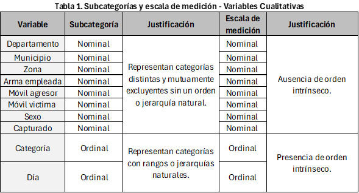

<br>
<div style="text-align: justify">
Sin duda alguna, la delincuencia es una preocupación diaria para los colombianos, pues noticias sobre hurtos y demás actos delictivos están al orden del día, tan solo hay que observar los datos publicados por Probogotá Región en 2023, los cuales mostraron que la extorsión, el hurto a personas, el homicidio, el hurto de automotores y el hurto a residencias son delitos en crecimiento en las diversas regiones del país, lo cual supone un gran desafío para las autoridades y una amplia preocupación para los ciudadanos [@saavedra2024delitos]. Por tanto, analizar una base de datos que comprenda información sobre esta cuestión supone un punto de partida beneficioso que puede llegar a aportar mayor compresión sobre las modalidades de hurto y delincuencia que predominan en el territorio nacional y posibles soluciones para disipar la presente problemática. 
<div/>
<br>
<div style="text-align: justify">
Teniendo en cuenta lo anterior, el objetivo principal de esta pagina web, es realizar un análisis estadístico descriptivo a partir del Dataset **hurtos2.csv**, mediante la realización de tablas de frecuencias, gráficos estadísticos y análisis de asimetría y dispersión que permitan obtener conclusiones coherentes y objetivas con la realidad que exponen los datos. 
<div/>
<br>
```{r setup, include=FALSE}
##Proyecto de estadística 1
##Leer Csv
library(ggplot2)
library(sf)
library(dplyr)
library(readxl)
library(fdth)
library(plotly)
library(qcc)
library(readr)
library(leaflet)
library(htmltools)
library(DT)
library (modeest)
library(moments)
library(explore)
library(lessR)
hurtos2 <- read_csv("hurtos2.csv")
knitr::opts_chunk$set(echo = TRUE)  
```
```{css,echo=FALSE}
.column {display:flex;}
h1{color:rgb(26, 72, 112)}
h2{color:rgb(26, 72, 112)}
```

# 1. Descripción del Dataset

Una vez importado el conjunto de datos mediante la función `read_csv()`,se pudo observar que se compone de 13 columnas y 100 filas, en donde las 13 columnas hacen referencia al número de variables, puesto que son las características bajo estudio que asume distintos valores para los distintos elementos del conjunto de datos. A continuación se observa la cantidad de variables y sus nombres:
```{r}
names(hurtos2) #Nombre de las columnas y por tanto de las variables
```
Por otro lado, como bien se mencionó, se tienen 100 filas que se configuran como el total de observaciones del conjunto de datos, por lo que cada fila se constituye como una observación individual que contiene datos para todas las columnas. Por tanto, considerando la cantidad de filas y columnas, el número de datos presente en el dataset son 1300, puesto que son las entradas individuales para cada observación o registro y para cada variable. En resumen, las dimensiones del dataset son las siguientes:

```{r}
num_rows <- nrow(hurtos2) #Número de observaciones (filas)
num_colums <- ncol(hurtos2) #Número de variables (columnas)
total_values <- num_rows*num_colums #Total de datos 

num_rows
num_colums
total_values
```
# 1.2 Clasificación de variables

Para realizar un análisis descriptivo es importante saber el tipo de variables, puesto que las características diferenciales que poseen las variables categóricas y numéricas hacen que el proceso de análisis difiera en cuanto herramientas y procedimientos para llegar a conclusiones válidas. Entonces, para saber la clasificación principal de las variables, se empleó el siguiente función:

```{r include=FALSE, paged.print=FALSE}
hurtos2_df <- data.frame(hurtos2)
```


```{r}
str(hurtos2_df) #Visualización de la estructura interna del conjunto de datos
```

como se observa, la función `str()` nos expone 2 tipos de varaibles: `char()` y `num()`, las cuales hacen referencia a las variables cualitativas y cuantitativas respectivamente. Como se observa la clasificación de las varaibles es la siguiente: 

- **<b style = 'color : rgb(26, 72, 112);'>Variables Categóricas:</b>** Comprenden nombres o etiquetas que indican atributos de algún elemento, además de ser variables que no son cuantificables o con las cuales no se pueden realizar operaciones aritméticas. 
  
  - **DEPARTAMENTO**: los departamentos como *Cundinamarca* o *Santander* son **nombres** de zonas geográficas del territorio nacional.
  
  - **MUNICIPIO**: al igual que en el caso de los departamentos, los municipios     son **nombres** de zonas geográficas especificas dentro de un departamento.
  
  - **DIA**: esta variable supone el **nombre** de los días de la semana. 
  
  - **ZONA**: comprende **categorías o etiquetas** de zona en donde ocurrió el       acto delictivo.
  
  - **ARMA.EMPLEADA**: Comprende las **clases o categorías** de armas empleadas     en el momento del delito.
  
  - **MOVIL.AGRESOR y MOVIL.VICTIMA**: Ambas variables comprenden la forma (categorías) en la que se movilizaban tanto los agresores como las victimas     en el momento del delito.
  
  - **SEXO**: es una variable que **etiqueta** a los víctimas como hombres o mujeres.
  
  - **CATEGORIA**: como su nombre lo menciona, esta variable hace referencia a  la **clase o categoría** de gravedad del delito cometido.
  
  - **CAPTURADO**: esta variable **etiqueta** a los agresores capturados y no         capturados.

- **<b style = 'color : rgb(26, 72, 112);'>Variables Cuantitativas:</b>** Comprenden números que indican cantidades, estas variables a diferencia de las categóricas, si son medibles y cuantificables.

  - **HORA**: es una variable que representa el tiempo en que se cometió el         crimen, por lo que es una variable medible y que se entiende como cantidad      de tiempo. 
  
  - **EDAD**: la edad se expresa en unidades numéricas, es una variable que se  puede medir o contar.
  
  - **ESTATURA_AGRESOR**:es una variable la cual se puede medir y cuantificar en unidades numéricas, como metros, centímetros o pulgadas.
  
## 1.2.1 Subclasificación de variables y escalas de medición

<br>
<div style="text-align: justify">
Si bien las variables se clasifican principalmente en cualitativas y cuantitativas, estás también se pueden dividir en subcategorías dependiendo si son numéricas o categóricas y, además, pueden adaptar diversas escalas de medición. A continuación, se presentan 2 tablas que resumen esta información. 
<div/>
<br>
**<b style = 'color : rgb(26, 72, 112);'>Variables Categóricas</b>**

 <center>
 {width=500}
</center>
<br>
<div style="text-align: justify"> 
consideran como variables nominales porque son nombres o etiquetas que no poseen un sentido de orden, pues, en el caso del sexo, no es posible establecer una propiedad o criterio que permita establecer que la etiqueta mujer es mayor o es primero que el hombre, por esa razón también las variables de naturaleza nominal tienen una escala de medición nominal. En cambio, variables como *Categoría* o *Día*, son nombres o etiquetas con una jerarquía, pues en el caso de *Categoría* al contener valores como “Muy alto”, “Alto”, “Medio”, “Bajo” y “Muy bajo”, se observa un claro orden que se justifica bajo el criterio de la gravedad del delito cometido. De igual forma, la variable *Día* al contener los nombres de los días de la semana posee un orden implícito que se configura como una secuencia, puesto que se sabe que lunes precede al martes, que precede al miércoles, etc.
<div/>
<br>
 **<b style = 'color : rgb(26, 72, 112);'>Variables Cuantitativas</b>** 
 
 <center>
 {width=500}
</center>
<br>
<div style="text-align: justify"> 
Con lo que respecta a las variables cuantitativas, variables como la *Hora* y la *Estatura del agresor* se obtienen mediante un proceso de medición, cuyos resultados pueden tener un número infinito de valores, puesto que pueden adaptar cualquier valor entre dos números consecutivos y ser expresados en decimales, es decir, en el caso de la estatura del agresor esta variable tiene valores como 1.57 o 1.70. Por otro lado, la variable *Edad* es discreta, puesto que en el conjunto de datos la forma que se expresa dicha variable es a través de número enteros, no hay ninguna que se exprese en términos de proporción o decimales. En cuanto las escalas de medición, las variables *Edad* y *Estatura del agresor* tienen una escala de medición de razón puesto que el cero simboliza que no hay edad o no hay estatura, asimismo, tiene sentido establecer proporciones, puesto que se puede llegar a decir que un delincuente tiene el doble de edad o estatura que otro. En el caso de la *Hora*, tiene una escala de intervalo, puesto que en le conjunto de datos están expresados en formato de 24 horas, es decir, en este caso el cero no simboliza ausencia de valor, sino que representa la medianoche.
<div/>
<br>

## 2. Observaciones del conjunto de datos {.tabset .tabset-fade .tabset-pills}
<div style="text-align: justify"> 
Una vez descrito las características y dimensiones del conjunto de datos, es importante visualizar la veracidad, practicidad y relevancia de los datos proporcionados sobre hurtos y delincuencia en las diversas regiones de Colombia. Si bien, de manera inicial se podría evidenciar que la base de datos no posee ningún valor **NULL**, **NA** o vacío, no quiere decir que la base de datos se encuentre completa o que permita un análisis bien fundamentado de este hito alrededor del país, puesto que, de acuerdo con la Constitución Política de 1991, Colombia se divide administrativa y políticamente en 32 departamentos, de los cuales, la base de datos solo considera 23 [@ramirez2016configuracion]. A continuación, se muestra los departamentos considerados en el estudio: 
<div/>
<br>
```{r}
cantidad_departamentos<- unique(hurtos2$DEPARTAMENTO)
cantidad_departamentos
```
<br>
<div style="text-align: justify">
Teniendo en cuenta los departamentos que aparecen dentro del estudio, se puede observar que Amazonas, Bolívar, Guainía, Guaviare, La Guajira, Putumayo, San Andrés y Providencia, Vaupés y Vichada no se consideran, por lo que se puede decir que la información que ofrece *hurtos2* no es suficiente para poder desarrollar un análisis descriptivo del fenómeno de la delincuencia en el territorio nacional, puesto que se omiten ciertas regiones y sus cifras correspondientes a estos hechos delictivos, lo que hace que el análisis no sea tan pertinente para englobar este fenómeno nacional en alza.  De igual forma, la no consideración de ciertas regiones también se presenta en el caso de los municipios, pues de los 1.119 municipios, el estudio solo contempla 37[@dane_tabla_municipios].  A continuación, se expone los municipios considerados:
<div/>
<br>
```{r}
cantidad_municipio<- unique(hurtos2$MUNICIPIO)
cantidad_municipio
```
<br>
<div style="text-align: justify">
Los municipios considerados en efecto se disponen en el conjunto de datos porque su respectivo departamento aparece, sin embargo, solo aparecen ciertos municipios representativos del departamento, lo cual, si bien se puede configurar como un dato estadístico muestral, no se considera pertinente para el objetivo del estudio, el cual es analizar la situación de hurtos y delincuencia alrededor del país. Por tanto, no tener consideración de los 1082 municipios restantes, puede conflictuar los resultados obtenidos, puesto que, al considerar pocos municipios de los departamentos a estudiar, puede originarse aproximaciones erróneas sobre cuales tienen mayor o menor nivel de delincuencia. A continuación, se muestra gráficamente los casos expuestos previamente: 
<div/>
<br>

### Mapa de regiones consideradas
<br>
<div style="text-align: justify">
Este mapa se realizó con el propósito de ilustrar de manera interactiva la falta de los datos previamente mencionados, en donde al acercar el cursor y dar en clic en cualquier departamento, se brinda información sobre el hecho de que si este fue considerado o no y el número de municipios que se consideraron por cada uno. En este sentido, también se dispuso de una escala de gradientes del 1 al 6, siendo 6 el máximo número de municipios que se llegaron a considerar en un departamento y 1 el menor número de municipios considerados, de igual forma aparece la notación **NA**, la cual considera aquellos departamentos que no hicieron parte del estudio. Por tanto, aquellos departamentos con una coloración azul más intensa son porque tuvieron un mayor número de municipios considerados, como el caso de Antioquia (6 municipios) y Santander (3 municipios), y los que tienden a tener una coloración más tenue es porque se consideraron solo 1 o 2 de sus municipios.  
<div/>
<br>
<div style="text-align: justify">
En efecto, gracias al mapa se puede visualizar que grandes regiones como el Amazonas y Vichada no se consideraron (representadas de color gris), lo cual en gran medida reafirma el problema de pertinencia general que pueden tener los resultados finales al no englobar la totalidad del territorio nacional. De igual forma, este problema también se evidencia a partir de los datos brindados por las etiquetas de cada departamento, puesto que, si bien Antioquia es el departamento con más municipios considerados, de sus 125 municipios solo se consideraron 6, razón por la cual la falta de completitud de los datos restringe un análisis descriptivo realista y coherente con el fenómeno de delincuencia y hurtos en Colombia.
<div/>
<br>
```{r,include=FALSE}

datos <- read_xlsx("datos-mapas7.xlsx")
geojson_url <- "https://gist.githubusercontent.com/john-guerra/43c7656821069d00dcbc/raw/be6a6e239cd5b5b803c6e7c2ec405b793a9064dd/Colombia.geo.json"
departamentos <- st_read(geojson_url)
datos_unidos <- departamentos %>%
  left_join(datos, by = c("NOMBRE_DPT" = "DPTO_CNMBR"))

paleta_colores <- colorNumeric(
  palette = "GnBu",  # Puedes cambiar esto a cualquier paleta que prefieras
  domain = datos_unidos$Municipios_considerados)
  
mapa <- leaflet(data = datos_unidos) %>%
  addProviderTiles(providers$CartoDB.Positron) %>%
  setView(lng = -74.2973, lat = 4.5709, zoom = 6) %>%
  addPolygons(
    fillColor =~paleta_colores(Municipios_considerados), # Cambia esto según tu variable de color
    weight = 2,
    opacity = 1,
    color = 'black',
    dashArray = '3',
    fillOpacity = 0.7,
    highlightOptions = highlightOptions(
      weight = 5,
      color = '#666',
      dashArray = '',
      fillOpacity = 0.7,
      bringToFront = TRUE
    ),
   popup = ~paste(
      "<b>Departamento:</b> ",NOMBRE_DPT, "<br>",
      "<table>",
      "<tr><td><b>Municipios considerados: ", Municipios_considerados, "</td></tr>",
      "<tr><td><b>Total de municipios: ", Total_municipios, "</td></tr>",
      "</table>")
  ) %>%
  addLegend(
    pal = paleta_colores,
    values = ~Municipios_considerados,
    title = "Municipios_considerados",
    position = "bottomright"
    )

```
```{r, echo=FALSE}
mapa
```

### Información sobre departamentos
```{r, echo=FALSE}
departamentos<-c(23,9)

pdepartamentos<-round(departamentos/
                        sum(departamentos)*100,digits = 2)

etiqueta<-paste(pdepartamentos,"%",sep=" ")

colores<-c("lightblue","grey")

pie(pdepartamentos,labels = etiqueta, clockwise = TRUE,col =colores, main= "Departamentos de Colombia en el conjunto de datos",cex.main = 1.5)

legend("topright",c("Considerados", "No considerados"), cex=0.8,fill= colores)
```
<div style="text-align: justify">
Con este diagrama de sectores se pretende comparar la proporción de departamentos considerados con los que no fueron considerados. Como se observa, la gran mayoría de los departamentos (71.88%) aparecen dentro de la base de datos *hurtos2*, sin embargo, el 28.12% no fue considerado, por lo que información de hurtos y delincuencia de dichos departamentos faltantes no podrá ser considerada.

### Información sobre municipios
```{r, echo=FALSE}
municipios<-c(37,1103)

pmunicipios<-round(municipios/
                        sum(municipios)*100,digits = 2)

etiqueta<-paste(pmunicipios,"%",sep=" ")

colores<-c("lightblue","grey")

pie(pmunicipios,labels = etiqueta, clockwise = TRUE,col =colores, main= "Municipios de Colombia en el conjunto de datos",cex.main = 1.5)

legend("topright",c("Considerados", "No considerados"),, cex=0.8,fill= colores)
```
<div style="text-align: justify">
Con este diagrama de sectores se pretende comparar la proporción de municipios considerados con los que no fueron considerados. Como se observa, a diferencia de los departamentos, solo el 3,25% de los municipios de Colombia fueron considerados en la base de datos, lo cual, teniendo en cuenta el 96,75% restante, simboliza que se pueden omitir ciertos datos relevantes que pueden cambiar el panorama de hurtos y delincuencia por departamentos. 


# Bibliografía